# Kompendie i GIB2

[toc]

## 01 Innledning

#### 01.01 Kjenne til begrepene Euklidisk rom og Euklidisk plan

**Euklidisk rom**: Også kjent som kartesisk rom, definert som et reelt endeligdimensjonalt vektorrom.  Etthvert punkt i et N-dimensjonalt euklidisk rom kan uttrykes ved N koordinater. Det er definert et euklidisk indreprodukt og en norm, som gjør at rommet har egenskaper fra euklidisk geometri, feks. Pythagoras læresetning. 

Tradisjonelt sett på som fundamentalområdet for klassisk geometri, med tre dimensjoner. $R^n$, equipped with the dot product. 

**Kartesisk plan**: Settet av alle (x,y)-tuppler der x og y er reelle tall. 

**Euklidisk plan:** Navnet på det euklidiske rom med dimensjon N=2, består av det kartesiske plan der avstand og vinkler regnes ut på følgende måte:

Normen til vektoren x = (x,y) er definert som følgende:
$$
||x||=\sqrt{x^2+y^2}
$$
Distansen mellom vektor $a=(a_1, a_2)$ og $b=(b_1, b_2)$ er gitt som følger:
$$
|ab|=||a-b||=\sqrt{(b_1-a_1)^2+(b_2-a_2)^2}
$$
Vinkelen $\alpha$ mellom vektor $a$ og $b$ er gitt ved:
$$
cos\alpha=\frac{a_1b_1+a_2b_2}{||a||\cdot||b||}
$$

#### 01.02 Kjenne til definisjoner og grunnleggende egenskaper til punktobjekt, linjeobjekt og polygonobjekt

**Punktobjekt**: Et punktobjekt definert i euklidisk plan, utrykt i kartesiske koordinater. Har ingen størrelse. Uttrykkes ved tuppelen (x, y). Sees ofte på som vektoren fra origo til punktkoordinatene, de kan derfor bli addert, substrahert, og multiplisert med skalarer i tråd med standard vektorregning. 

**Linjeobjekt**: 

* Linje: Gitt to distinkte punkter $a$ og $b$ i $\R^2$, så er linjen definert som punktsettet $\{\lambda a+(1-\lambda)b|\lambda\in\R\}$
* Linjesegment: Gitt to distinkte punkter $a$ og $b$ i $\R^2$, så er linjesegmentet mellom punktene definert som punktsettet $\{\lambda a+(1-\lambda)b|\lambda\in[0, 1]\}$
* halvlinje: Gitt to distinkte punkter $a$ og $b$ i $\R^2$, så er halvlinja fra $b$ som passerer $a$ definert som punktsettet $\{\lambda a+(1-\lambda)b|\lambda=0\}$

**Polygonobjekt**: En slutning av linjeobjekter. 

#### 01.03 Vite hva som kjennetegner konveks, stjerneformet og monotont polygon

**Konveks polygon**: Interne vinkler overskrider aldri 180 grader. Alle punkt er se-bare fra hvert punkt. 

**Stjerneformet polygon**: Svakere egenskap enn konveks polygon, man trenger kun at et punkt er synlig fra alle andre punkter 

**Monotont polygon**: Basert på monotone kjeder, gitt at $C=[p_1, p_2,....,p_n]$ er en ordnet liste med $n$ punkter i det euklidiske plan. Da er C monotont, hvis og bare hvis det finnes en linje i det euklidiske plan der projeksjonen til punktene beholder  ordningen til listen. 

Et polygon er monotont hvis det kan splittes til to linjeobjekter, slik at hver av linjeobjektene er en monoton kjede. 

#### 01.04 Kjenne til ulike typer transformasjoner i det Euklidiske plan 

**Euklidiske transformasjoner: **Bevarer form og størrelse til objektene, et eksempel er translasjon. 

**Similarity transformasjoner:** Bevarer form, men ikke nødvendigvis størrelse. Et eksempel er skalering. Alle euklidiske transformasjoner er similarity transformasjoner. 

**Affine transformasjoner:** Bevarer affine egenskaper, da altså kollinearitet, og avstandsforhold. Midtpunktet på et linjesegment er fortsatt midtpunktet etter en Affin transformasjon. Eksempler er rotasjon, refleksjon og shear(skjæring?). Alle similarity transformasjoner er affine transformasjoner. 

**Projektive transformasjoner**: Bevarer projektive egenskaper, mapper linjer til linjer, men bevarer ikke kollinearitet. Alle affine transformasjoner er projektive transformasjoner.  

- Linjer fra hvert punkt til et objekt gjennom et projeksjonssenter, planet som skjærer linjene avgjør projeksjonen

**Topologiske transformasjoner**: Bevarer topologiske egenskaper. Også kalt homeomorfisme. En topologisk transformasjon kan stretche, vri, og komprimere en figur, men kan ikke rive den, punktere den eller gjøre slik at objektet skjærer seg selv. 

#### 01.05 Kjenne til grunnleggende definisjoner innen settbasert romlig geometri 

**Sett**: Samling av unike elementer. Definisjonen er oppe for diskusjon: Russells paradox. 

**Element**: Objekter som skal modelleres

**Medlemskap**: Forholdet mellom elementene og settene de tilhører/ikke tilhører. I tradisjonell sett-teori er dette binært, skal lære mer om det i fuzzy-sets. 

**Equality (Likesett)**: Er et forhold mellom to sett som er gyldig hvis de har nøyaktig samme medlemmene. 

**Subsett**: Er et forhold mellom to sett hvor hvert medlem i et sett er et medlem i et annet sett. Det at settet S er et subsett av settet T skrives på følgende måte: 
$$
subsett=S\subseteq T
$$
**Powersett**: Settet av alle subsettene til et sett. Powersett skrives på følgende måte: 
$$
powersett=\wp (S)
$$
**Det tomme settet**: Settet som ikke har noen medlemmer, skrives:
$$
det\space tomme\space sett=\emptyset
$$
**Kardinalitet**: Antallet medlemmer i et sett, kardinaliteten uttrykkes $\#S$

**Snitt**: Binær operasjon som tar to sett og returnerer de elementene som er medlem i begge originalsettene. Snitt av settene S og T uttrykkes:
$$
snitt=S\cap T
$$
**Union**: Binær operasjon som tar to sett og returnerer settet av elementer som minst er medlem i ett av originalsettene. Unionen av settene S og T uttrykkes:
$$
union=S\cup T
$$
**Differanse**: En binær operasjon som tar to sett og returnerer settet av elementer som er med i det første settet, men ikke det andre. Differansen av settene S og T uttrykkes: 
$$
differanse=S\backslash T
$$
**Komplement:** En unary operasjon som tar et sett og returnerer elementene som ikke er med i det settet. Komplementet er tatt med referanse til et implisitt universalt sett. Komplementet til Settet S skrives:
$$
komplement=S'
$$
**Eksempler på sett**: 

#### 01.06 Kjenne til hva begrepene relasjoner og funksjoner står for i settbasert teori

**Produkt**: En binær operasjon som tar to sett og returnerer settet med ordnede par, der første element er medlemmer fra første sett, og andre element er medlemmer fra andre sett. Produktet til settene S og T skrives: 
$$
produkt= S\times T
$$
Produktrommet gir en mulighet til å definere relasjoner mellom objekter. 

**Binær relasjon**: Et subsett av produktet til to sett der det ordnede parret viser relasjonene mellom medlemmene i det første settet og medlemmene i det andre settet. 

**Refleksiv relasjon:** Hvert eneste element i et sett relaterer til seg selv

**Symmetrisk relasjon:** Hvis $x$ er relatert til $y$ er $y$ relatert til $x$

**Transitiv relasjon:** Hvis $x$ er relatert til $y$ og $y$ er relatert til $z$, så er $x$ relatert til $z$

**Ekvivalent reasjon**: Oppfyller alle relasjoner, refleksiv, symmetrisk, transitiv.

**Funksjoner:** Spesiell type relasjon som har egenskapen at hvert medlem i det første settet relaterer til nøyaktig ett medlem i det andre settet. Funksjonen former da en regel som transformerer hvert medlem i det første settet, domenet, til et medlem i det andre settet, kalt kodomenet.
$$
f: S\rightarrow T
$$

## 02 Romlige datamodeller og nettverk

#### 02.01 Kjenne begrepene kildedomene og måldomene, og skissere hvordan de relaterer til hverandre

**Kildedomene**: Kildedomenet består av entiteter, relasjoner, prosesser, eller andre ting av interesse. 

**Måldomene**: En representasjonen av kildedomenet.

**Modell**: Kunstig konstruksjon som tar kildedomenet og transformerer det til måldomenet. Målet er å forenkle og abstrahere fra kildedomenet. Medlemmer av kildedomenet blir oversatt til måldomenet, som igjen kan observeres og analyseres for å få innsikt, resultater etc. 

* Eksempel på modell: 

  Kildedomene: Den virkelige verden
  Måldomene: Kart
  Modell: Oversettelsen fra virkelig verden til kart

En god modell simulerer den virkelige verden på en god måte, det bør også være enkelt å flytte seg mellom de to domenene. 

#### 02.02 Vite hva som kjennetegner en feltbasert modell

**Feltbasert modell (rasterbasert)**: En feltbasert modell behandler geografisk informasjon som en samling av romlige distribusjoner. Hver distribusjon er formalisert som en funksjon mellom et romlig rammeverk (feks. et grid plassert på en idealisert model av jordas overflate) til et attributt-domene. 

**Fremgangsmåte:**

1. Konstruere romlig rammeverk
2. FInne passende verdi-domene for attributter
3. Samle verdier
4. Analysere

#### 02.03 Kjenne til ulike egenskaper ved felt

**Romlig rammeverk**: Regulært eller ikke-regulært, vil ofte være et euklidisk rom som muliggjør måling av lengder og vinkler. Oppløsningen til rommet er viktig og bør tilpasses den datatypen og analysen man har lyst til å gjøre.

**Attributt-domene:** Målinger som passer under en av disse typene

- **Nominell:** Kvalitativ data, kan ikke regnes på. Består av enkle labels som ikke kan sorteres. Eks: Navnet på en by
- **Ordinale:** Kvantifiserer labels på en lineær skala. Størrelsesorden er ikke medregnet, altså hvor mye bedre/dårligere ting er. Man kan ikke gjøre aritmetiske regneoperasjoner på ordinale attributter.  
- **Interval:** Kvantifiserer ved å definere relativ posisjon mellom labels på en intervall-skala. Denne typen har ikke referanse til et attributt-origo, som foreksempel at 20 grader celsius ikke nødvendigvis er dobbelt så varmt som 10 grader celsius. 
- **Ratio:** Målinger på en intervall-skala med et bestemt origo. Sånne målinger støtter mange aritmetiske operasjoner.
- **Null:** Null blir registrert når verdien er ukjent eller det ikke gir mening å måle den. Eks: Tre-type på havet.  

**Romlig felt-funkson(spatial field function)**: NB: merk at det er selve funksjonen som er feltet, ikke det romlige rammeverket eller attributtene

- **Kontinuerlig:** Et felt er kontinuerlig hvis felt-funksjonen er kontinuerlig. Små endringer i romlig rammeverk fører til små endringer i attributten. Gir bare mening hvis 'liten forandring' er definerbart i både rammeverket og i attributt-domenet.
- **Differensiabel:** Et felt er differensiabelt hvis helningen til den underliggende felt-funksjonen alltid er definert. Altså, en glatt funksjon, gir kun mening i et kontinuerlig definert romlig rammeverk og attributt-domene. 
- **Kontinuerlig og diskret variasjon:** Se for deg to målinger av samme fenomen på to forskjellige tidspunkter, måling A og måling B. Hvis det gir mening å anta at det går ann å interpolere verdiene A og B for å finne ut hvor forekomsten har vært mellom de to målte tidspunktene er det en kontinuerlig variasjon. Diskret hvis ikke. 

#### 02.04 Kunne forklare kontinuerlige romlige felt og differensiable romlige felt 

Se 02.03 Romlig felt-funksjon.

#### 02.05 Vite hva et isotropisk felt er

**Isotropisk felt**: Karakteristisk felt der egenskapene er de samme, uavhengig av retningsvektor. (Bearing)

#### 02.06 Kjenne til vanlige romlige operasjoner på felt

**Romlig operasjon**: En romllig operasjon tar inn ett eller flere felt og returnerer et resultantfelt. Man deler inn i hovedkategorier/klasser av romlige operasjoner. Algebraen til felt-baserte modeller er spesifisert som strukturen til alle mulige operasjoner man kan bruke på romlige felt-funksjoner. Disse operasjonene tar felt-funksjoner som argument og produserer en ny resultantfunksjon. 

**Naboskap (neighboorhood)**: Gitt et romlig rammeverk F, så er en naboskap-funksjon som assosierer hver lokasjon $x$ med et sett av lokasjoner som er 'i nærheten av' $x$. En naboskap-funksjon n: vil gi et subset av F hvis $x$ er en lokasjon i F.

Eksempler:

* Euklidisk rom: Naboskap defineres utifra distanse eller vinkler
* Metrisk rom: Naboskap defineres utifra distanse
* Topologisk rom: Naboskap defineres utifra toplogisk naboskap

**Soner**: Gitt en romlig felt-funksjon $f$, så er en $f-sone$ et subset av $F$, der medlemmene oppfyller et krav gitt i $f$. $f-soning$ av $F$ betyr å partisjonere $F$ i 'disjointe' soner. 

**Lokaloperasjon**: Distinkt i den forstand at verdien til den nye funksjonen ved en vilkårlig lokasjon kun er avhengig av verdiene til den samme input-lokasjonen. Kan ta et vilkårlig antall input-felt, altså n-ary. 

**Fokaloperasjon**: Distinkt i den forstand at verdien til den nye funksjonen ved en villårlig lokasjon er avhengig ikke bare av verdien til den samme input-lokasjonen, men av naboskapet til lokasjonen i tillegg. 

**Soneoperasjon**: Soneoperasjoner aggregerer verdier til et felt, med hensyn på sonene i feltet(som kan ha kommet fra en annen romlig sone-funksjon). 

Framgangsmåte:

For alle $x$

1. finn sonen som $x$ er en del av
2. Regn ut verdien til felt-funksjonen $f$ i det punktet 
3. Basert på $f$-verdiene til hver individuelle $x$ innenfor hver sone, utled en ny felles verdi for hele sonen. 

#### 02.07 Vite hva som kjennetegner et objekt

**Objekt**: I objekt-baserte modeller bryter man ned informasjonsrommet til objekter *eller entiteter*. En entitet har følgende karakteristikk:

* Identifiserbar
* Relevant (er av interesse for oss)
* Mulig å beskrive (har karakteristikker)
  Attributter, dimensjoner **(Romlig, grafisk, temporalt, tekst)** 

#### 02.08 Kjenne til typiske definisjonsrom for objektene

**Definisjonsrom**: Hvilke rom objekter lever i vil ha en direkte påvirkning på hvordan objektene spesifiseres og kan realiseres. 

**Euklidisk definisjonsrom**: Muliggjør mål på avstand og vinkler mellom objekter. Kan uttrykkes som sett av koordinat-tupler.

**Metrisk definisjonsrom**: Muliggjør mål av avstand mellom objekter. Et eksempel er kart over reisetid, gitt at reisetiden fra $x$ til $y$ er det samme som motsatt. 

**Topologisk definisjonsrom**: Muliggjør topologiske relasjoner mellom objekter. Eksempler på topologiske relasjoner er 'connectivity' og 'adjecency'

**Sett-basert definisjonsrom**: Muliggjør generelle settbaserte relasjoner, sånn som medlemskap, union og snitt. Hierarkiet til administrative regioner er et eksempel på settbasert rom. 

#### 02.09 Kjenne til hva vi mener med positiv og negativ romlig autokorrelasjon

**romlig autokorrelasjon**: Romlig autokorrelasjon er et kvantitivt uttrykk for Tobler's første lov om geografi:

> 'Everything is related to everything else, but near things are more related than distant things' 

Romlig autokorrelasjon er altså et mål på hvilken grad verdier av samme størrelsesorden er gruppert i et romlig felt. 

* Positiv romlig autokorrelasjon: Like verdier har en tendens til å samle seg i grupper
* Negativ romlig autokorrelasjon: Like verdier har en tendens til å distansere seg

#### 02.10 Kjenne til ulike definisjoner og egenskaper til grafer

**Graf (Nettverk)**: Nettverk i fagets forstand er en datamodell for å modellere relasjoner mellom objekter. Man har **knutepunkter**(noder, vertices) og **kant**(vei, edges). Veiene forbinder knutepunktene og beskriver derfor sammenhengen i nettverket.  

**Rettede grafer**: I rettede grafer er veiene enveiskjørte.

**Urettede grafer**: I urettede grafer kan man gå fram og tilbake på samme kant. 

**Sammenhengende grafer**: Alltid en sti mellom to tilfeldige noder.

**Isomorfe grafer**: Topologien er lik, men avstand og posisjon til nodene kan være forskjellige. 

**Trær**: Trær er et spesialtilfelle av en rettet graf, der man har et knutepunkt som definert 'rot' eller startpunkt. 

#### 02.11 Kjenne til sykliske og asykliske grafer

**Syklisk graf**: En graf er syklisk hvis det finnes en sti der første og siste node er den samme. En sti er en vei der man kun besøker en node en gang. 

**Asyklisk graf**: Det motsatte av en syklisk graf, det finnes ikke en sti som gjør at man kommer tilbake til start.  

#### 02.12 Kjenne til hva en planar graf er

**Planar graf**: En planar graf er en graf som kan tegnes i planet, slik at ingen kanter krysser hverandre. 

#### 02.13 Vita hva duality mellom grafer er

**Face**: Bundet område av en graf

**Duality**: For en planar graf $G$, er dual-grafen til $G$ merket $G$*. Den er konstruert ved å sette $G$* * sine knutepunkter i hvert *face* til $G$. Kantene til $G$* settes ved å tegne en kant mellom hvert knutepunkt, der de tilsvarende *face*-ene er naboer.  

Sammenhengen mellom Delauney og Voronoi er dualitet. 

#### 02.14 Vite definisjonen på et metrisk rom og kunne komme med eksempler på metriske og ikke-metriske rom

**Metrisk rom**: Se 02.08, **Metrisk definisjonsrom**

Eksempel på ikke-metrisk rom: reisetid-distanse

#### 02.15 Nettverk

se s. 34 i algdatkompendiet.

#### 02.16 Korteste vei i nettverk (Dijkstra's)

Tillater: Positive sykler

Tillater ikke: Negative kantverdier eller negative sykler

Korteste vei, en til alle (SSP)

Fremgangsmåte:

1. Lag en prioritertskø Q, med alle nodene i grafen
2. Hent ut noden fra Q som har lavest kostnad, kalt u.
3. Slakk nabonodene til den uthentede noden og oppdater distansense til nabonodene. Altså ny distanse for hver nabonode v er gitt av min(gammel distanse, distanse(u) + distanse(u,v))  
4. Gjenta til Q er tom.

## 03 OGC - WMS - WFS

#### 03.01 Kjenne til Open Geospatial Consortium

**OGC - Open Geospatial Consortium**: Deres oppgave er blandt annet å komme opp med spesifikasjoner for Internet Gis-design slik at systemer fra ulike leverandører kan snakke sammen

#### 03.02 Kjenne til WMS og ulike grensesnitt som er brukt for dette

**WMS**: Web Map Service, hente et kart via standard url-syntax. 

1. Skal produsere et kart
2. Skal kunne svare på enkle spørsmål om innhold
3. Skal kunne svare på hvilke kart som kan produseres, og hvem man kan stille videre spørsmål til

**WMS - 4 trinns prosess**:

1. Filtrering, gjøre utvalg av data
2. Generering av elementene som skal vises
3. Gjengi elementene på kartet
4. Vis kartet til brukeren

#### 03.03 Kjenne til WFS og ulike grensesnitt som er brukt for dette

**WFS:** Web Feature Service, overføring av kart og geodata ved hjelp av Geography Markup Language (GML). Overfører data som tema på vektorform. 

**Client-Server relasjon**:

1. Klienten spør hvilke operasjoner serveren støtter, og hvilke tema den kan levere
2. Klienten **kan** anmode serveren om mer informasjon om et av temaene
3. Basert på informasjonen gitt gjør klienten et nytt kall for å hente ut informasjonen. 
4. WFS blir koblet inn for å svare på forespørselen
5. Etter at WFS er ferdig med leveransen sendes den og en statusrapport tilbake til klienten

**Protokoll**: WFS bruker HTTP som protokoll, og støtter følgende operasjoner:

1. Insert
2. Update
3. Delete
4. Query
5. Discovery

#### 03.04 Kjenne til forskjeller mellom basis WFS og transaksjons-WFS

**Basis WFS**: Har utelukkende lesefunksjoner (GetCapabilites, DescribeFeatureType, GetFeature), dermed et 'read only'-system. 

**Transaksjons-WFS**: Har i tillegg til lesefunksjoner *Transaction* og *LockFeature*, som gjør det mulig for klienten å endre på databasen. 

#### 03.05 Kjenne til oppbygningen av GML

**HTML**: Hypertext Markup Language, et formateringsspråk der både struktur og grafisk fremvisning er definert i ett (ish).

**XML**: Mens HTML kun har begrenset antall tags har XML muligheten til å definere egne tags i et tilhørende DTD (Document-Type Definition). 	

**GML**: GML er derfor en implementasjon av XML med tags som beskriver egenskaper, geometrier og lokalisering til romlig data. GML er egnet for å kode, lagre og overføre romlig data. 

Basert på:

- Geometriskjema
- Temaskjema
- Xlink

#### 03.06 Ha en grov oversikt over ulik open programvare i sammenheng med geografisk informasjon

**ARCIMS**: Arc Internet Map Server, data, spatial server, webserver, client

**GeoMedia WebMap**: Samme struktur, bare 2 spatial servers. 

**FOSS**: Free and OpenSource Software

Biblioteker:

1. GDAL
2. Proj4
3. JTS
4. GEOS
5. GeoTools

Databasesystem:

1. PostgreSQL / Postgis
2. MySQL

Kartserver:

1. UMNMapServer
2. GeoServer
3. MapGuide Open Source

Web-verktøy:

1. Leaflet
2. OpenLayers
3. Mapbox
4. MapFish

FOSS Desktop Gis:

1. Qgis
2. Grass

## 04 Flytende mengder (fuzzy set)

#### 04.01 Vite hva vi mener med flytende mengder og komme med ulike eksempler

**Flytende mengder**: I tradisjonell mengdelære snakker man om binære medlemskapsfunksjoner, enten er du med eller så er du ikke. I flytende mengder utvider man den tolkningen beskrive hvilken grad av tilhørighet man snakker om. Dette gjør oss istand til å svare på flere spørsmål i GIS, der det tradisjonelt sett bare er snakk om skarpe mengder. 

**Eksempler:**  I hvilken grad et sted tilhører et område. I hvilken grad man har høy eller lav lønn i forhold til det arbeidet man gjør. 

#### 04.02 Vite hva vi mener med skarpe mengder

**Skarpe mengder**: Som tidligere nevnt, man har en binær medlemskapsfunksjon som definerer om et element er med eller ikke. Dette definerer entydige definisjoner for områder/mengder. 

#### 04.03 Vite hva en medlemskapsfunksjon er

**Medlemskapsfunksjon**: gir et mål på hvilken grad av tilhørighet et element har til en mengde. 

**Medlemskapsfunksjon for skarpe mengder**: La $X$ betegne en universell mengde. Den karakteristiske funksjonen til en skarp mengde $A$ tilordner en verdi $\mu_A(x)$ til hver $x$ $\in$ $X$ slik at:
$$
\mu_A(x)= \cases{1 \space \space x \in A\\0 \space \space x\notin A}
$$
Dette kan også skrives som: $\mu_A: X \rightarrow \{0, 1\}$

**Medlemskapsfunksjon for flytende mengder:** La $X$ betegne en universell mengde. Den karakteristiske funksjonen til en flytende mengde $A$ tilordner en verdi $\mu_A(x)$ til hver $x$ $\in$ $X$ slik at: 

$\mu_A: X \rightarrow [0, 1]$

Viktig å poengtere at det da altså gir en verdi på det lukkede intervallet mellom 0 og 1. 

#### 04.04 Kunne regne ut komplement, union og snitt til flytende mengder

**Komplement**: Komplementet er definert på følgende måte: $\mu_{A'}(x)= 1-\mu_{A}(x)$

**Union**: Union er definert på følgende måte: $\mu_{A\cup B}(x)= max[\mu_{A}(x), \mu_{B}(x)]$

**Snitt**: Snitt er definert på følgende måte: $\mu_{A\cap B}(x)= min[\mu_{A}(x), \mu_{B}(x)]$

#### 04.05 Forstå og kunne bruke de samme operasjonene på Yagerklassen

**Yageroperasjoner**: Det finnes flere måter å regne komplement, union og snitt av flytende mengder, så lenge de fyller noen aksiomer. Vi trenger operatorer som er kommutative, assosiative og og kontinuerlige. Yagerklassen av operatorer er operatorer som oppfyller disse kravene. 

**Yagerkomplement**: Yagerkomplementet er definert på følgende måte: $c_w(a) = (1 − a^w)^{1/w}$

**Yagerunion**: Union er definert på følgende måte: $u_w(a, b) = min[1,(a^w + b^w)^{1/w}]$

Jo lavere yagerverdi, jo mindre av det totale området dekkes. 

**Yagersnitt**: Snitt er definert på følgende måte: $i_w(a, b) =1 − min[1,((1 − a)^w + (1 − b)^w)^{1/w}]$

$w$ er en brukerstyrt parameter som bestemmer egenskapene til yager-funksjonene. Tallet går fra $[0, \inf]$

Jo lavere yagerverdi, jo mer overlapper områdene. 

#### 04.06 Vite hva vi mener med høyden til en flytende mengde

**Høyden**: Høyden til en flytende mengde er det elementet med høyest medlemskapsverdi i den mengden. 

#### 04.07 Vite hva et alfa-kutt er

**Alfakutt**: Et alfakutt til en flytende mengde $A$ er den skarpe mengden $A_{\alpha}$ der elementene til $A$ oppfyller følgende krav: $\mu_{A}(x)\geq \alpha$ For en gitt $\alpha$-verdi. 

#### 04.08 Kunne benytte middeltallsberegninger med vekting for flytende mengder

**Middeltallsberegninger for flytende mengder**: Det er en tredje måte å kombinere flytende mengder på, det er middeltallsberegninger. Dette er et form for gjennomsnitt, som legger seg mellom yager-snitt og yager-union.
$$
h_{\alpha}(a_1, a_2,..., a_n, w_1, w_2,..., w_n)=(\sum_{i=1}^{n}w_ia_i^{\alpha})^{1/\alpha}
$$
Forutsetter at summen av $w=0$. Her har man mulighet til å vekte parametre opp mot hverandre. 

## 05 Topologi

#### 05.01 Vite hva det betyr at to objekter er homeomorfe

**Homeomorfe**: To geometriske objekter A og B er homeomorfe, dersom vi kan avlede det ene objektet fra det andre ved å tøye, krympe, rotere eller forskyve et av objektene. Så lenge man kan forme det ene objektet fra det andre uten å måtte ty til splitt eller klipping, er objektene homeomorfre.

#### 05.02 Kjenne til definisjoner på lukket mengde, samt indre og omriss til mengden

**Indre til en mengde**: Den største åpne mengden som er innebefattet i $A$. Hvis vi bruker en sirkelanalogi er det alle (x, y)-tupler som oppfyller $x^2+y^2<1$ 

**Omriss til en mengde**: Hvis vi bruker en sirkelanalogi er det alle  (x, y)-tupler som oppfyller $x^2+y^2=1$ 

**Lukket mengde**: Unionen av indre og omriss, hvis vi bruker en sirkelanalogi er det alle  (x, y)-tupler som oppfyller $x^2+y^2\leq1$ 

#### 05.03 Kjenne til definisjoner for sammenhengende rom

**Sammenhengende rom:** Et rom $X$ er sammenhengende dersom det ikke er unionen av to
ikke-tomme disjunkte lukkede delmengder. Rommet $X$ er usammenhengende dersom
det ikke er sammenhengende.

**Sammenhengende rom del 2**: Gitt et topologisk rom $S$ og et subsett $X$ tatt fra rommet $S$. $X$ er da sammenhengende hvis (når man partisjonerer dem i 2 disjunkte subsett $A$ og $B$) har det slik at et punkt i $A$ er i nærheten av et punkt i $B$ eller motsatt. 

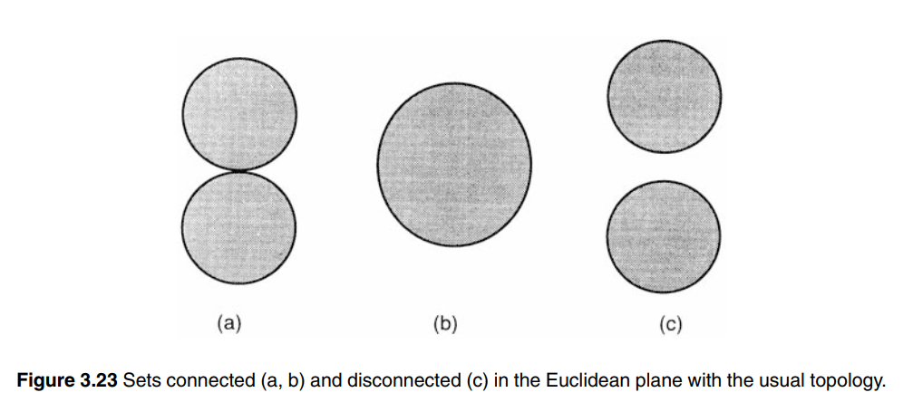

#### 05.04 Kjenne til ulik bruk av topologi i geografiske datasett

**Svak bruk av topologi**: Hvis man bruker standarder med en svak forankring i topologi vil dette føre til uklar og inkonsistent terminologi, samt at topologiske relasjoner ikke lar seg fullstendig uttryke. 	

#### 05.05 Kjenne til metoder for å beskrive topologiske relasjoner mellom mengder

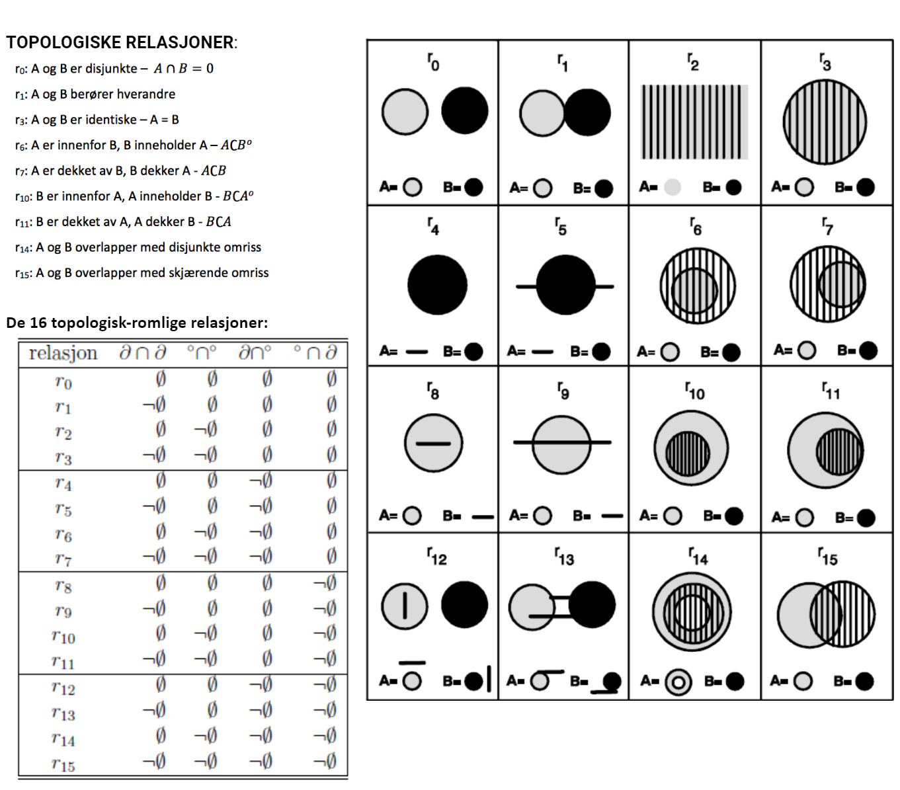

#### 05.06 Kjenne til 4-snittsmodellen

**4-snittsmodellen**: 4-snittsmodellen er en måte å uttrykke topologiske relasjoner mellom to delmengder $A$ og $B$. 
$$
r = (∂A∩∂B,A^o∩B^o,∂A∩B^o,A^o∩∂B)
$$
Siden hvert av de fire snittene enten kan ha verdien $\empty$ eller ikke, har vi $4^2$ unike topologiske relasjoner mellom delmengdene. 

#### 05.07 Kjenne til definisjonen på romlige regioner

**Romlig region**: Gitt at $X$ er et sammenhengende topologisk rom, så vil en romlig region i $X$ være en ekte delmengde $A$ der

1. det indre i $A$ er sammenhengende
2. $A$  er en lukket mengde
3. og $A$ er ikke den tomme mengden. 

#### 05.08 Kjenne de 9 topologiske relasjonene vi har mellom to romlige regioner

**Grunnlag**: Hvis $A$ er en romlig region er $A$ en lukket mengde, altså kan ikke omrisset til $A$ være den tomme mengden. 

**De 9 topologiske relasjonene**: relasjonene $r_4, r_5, r_8, r_9, r_12, r_{13}$ er ikke gyldige for romlige regioner, da gjenstår det 9 topologiske relasjoner.

**Tabell over de 9 relasjonene:**

#### 05.09 Vite hva vi mener med 9-snittsmodellen

**9-snittsmodellen**: 9-snittsmodellen er en utvidelse av 4-snittsmodellen, man tar forbehold til en ny dimensjon, nemlig det yttre av enten $A$ eller $B$. Dette er for å relatere delmengdene til resten av rommet, ved å se for seg en tenkt punktmengde utenfor både $A$ og $B$. Beskriver i utgangspunktet opptil 512 topologiske relasjoner mellom $A$ og $B$, men det er bare mulig å uttrykke 19 for 0, 1 og todimensjonale objekter i $\R^2$ 

#### 05.10 Kunne vise en del aktuelle topologiske relasjoner mellom en linje og et areal i 9-snittsmodellen

## 06 3D GIS Avansert nettverksanalyse

### 06.01 Geometri og topologimodeller i 2-og 3D

#### 06.01.01 Forstå det matematiske grunnlaget for topologiske relasjoner

**Topologiske relasjoner:** Se 05, håper ikke vi skal kunne noe mer enn det.

**$\delta$-ball**: 'Deltaball', deltaballen omslutter alle punkter som er en liten avstand <$\delta$ fra et punkt. 

**Naboskap**: Naboskapet til punkt p er mengden V der det er mulig å finne en delta-ball der alle punkter i ballen er innehold i V. 

**Indre av en punktmengde**: For alle punker i mengden S der en deltaball vil inneholde andre punkter i S

**Yttre av en punktmengde**: For alle punkter ikke i mengden S, der en deltaball ikke vil inneholde punkter i S. 

**Omrisset av en punktmengde**: Mengden av alle punkter der delta-ballen inneholder punkter som er med i S og punkter som ikke er med i S. 

**Ikke-sammenhengende punktmengder:** Punktmengder der ingen av dem har den andre i sine naboskap

#### 06.01.02 Kjenne til de viktigste datastrukturer for å modellere geografiske objekter og deres topologiske relasjoner i 2 og 3 dimensjoner

**Behov**: I matematikken har vi uendelig små punkter, uendelig nøyaktig avstandsmål og uendelig mange punkter. I datamaskiner er vi begrenset av lagringsplass og prosesseringstid. (presisjon, antall punkter)

**Implisitt  topologi**: Heleid geometri, objekter eier sine egne endepunkter/omriss. Dette fører til multippel lagring av omrissobjekter, og topologiske relasjoner må bestemmes ved geometrianalyse. 

* **Utfordringer**: Hvor nært er "samme punkt", hva er samme linje eller samme flate. Disse presisjonsproblemene fører til at man må bruke topologivask. 

**Topologivask**: Snappe punkter til hverandre, harmonisere grenseflater og grenselinjer. 

**Simple feature**: 

* Punkt: Et punkt er singulært, har bare en koordinatverdi
* Line: En sekvens av koordinater, finnes ved å gjøre lineær interpolasjon mellom 2 endepunkter
* LinearRing: Kan avgrense en flate, første og siste endepunkt er det samme. 
* Polygon: Har en Ring som ytre avgrensning, kan også ha indre ringer som definerer hull. 
* PolyhedralSurface: Sammenhengende samling av polygoner, ingen overlapp eller mellomrom

**Dataformater og programmer som støtter simple feature:** GML, WKT, GeoJson, Postgres/Postgis, Oracle Spatial

**Features med delt geometri**: For å svare på noen av utfordringene med implisitt topologi, introduserer man delt geometri. Det låner hovedtrekkene fra Simple feature, men nå er kurvesegmenter egne objekter og kan inngå i flere features. En ring eller kurve består av kurvesegmenter. 

* Når du da har en flate med delte grenselinjer så kjenner flaten sine grenser, men kurvesegmentet (grensen) i seg selv vet ikke hvilke flater den tilhører. 
* PolyhedralSurface: flate sammensatt av planare «lapper»
* TriangulatedSurface: PolyhedralSurface med bare triangler, kan approksimere alle glatte flater. 
* Skall: Utvider simple feature med skall, altså vanntette omslutninger man kan regne volum utifra. Skallene kan bestå av egne flater som igjen har egne attributter. 

Delt geometri sees på som et greit kompromiss, det er enklere å finne felles grenselinjer, og filstørrelsen blir mindre. 

**Dataformater som støtter delt geometri:** GML 3.x, SOSI 5.0 over GML, CityGML, TopoJson

**Fullkoblet eksplisitt geometri**: Lagrer alle topologiske relasjoner, et knutepunkt vet hvilke linjer den forbinder. En grenselinje vet hvilke flater den avgrenser. Geometrien lagres bare en gang og kobles til mange objekter. 

**Edge**: Forbindelseslinje mellom to noder

**Node**: Knutepunkt for flere edges

**Face**: Et flateobjekt avgrenset av en eller flere edges? (Her burde det vel vært flere?)

#### 06.01.03 Kjenne til hvordan disse realiseres i enkelte vanlige standardformater

Eksempler på bruk i GeoJson eller TopoJson?

### 06.02 3D GIS

#### 06.02.01 Forstå hvordan datamodeller beskrevet i andre deler av kurset kan utvides til å håndtere 3D data

[Skrevet opp som spørsmål]

#### 06.02.02 Kjenne til de viktigste bruksområder for 3D data

**Beregninger**: Masseberegninger, konflikanalyse, mobiltelefondekning

**Visualisering**: Nåsituasjon, plan, beregningsresultater

**Analyse**: Lys og skygge, siktforhold, vurdering av tiltak

#### 06.02.03 Forstå hovedtrekk av prosessen for 3D visualisering

**Datastrukturer for visualisering:**

- Triangler: Koordinater, normalvektor, Farge og bildekoordinater
- Transformasjonsmatriser (modelling, camera, projection, viewport)
- Lyskilder
- Materialegenskaper
- Scenegraf

**LOD**: Level of Detail, et hierarki for å velge detaljnivå. Kan være lurt med myke overganger når man zoomer inn eller ut (morphing, fading)

**Løkken til programmet**:

1. ta imot brukerinteraksjon
2. Utfør periodiske endringer i dataen
3. søk gjennom scenegrafen for å finne synlige objekter
4. sett sammen transformasjonsmatrisen
5. Sorter på grafikkattributter (optimaliser)
6. Utfør utregning

**Eksempler på slike 'retained mode-programmer'**:

Open Inventor(C++/OpenGL)

Three.js(Javascript/WebGL)

#### 06.02.04 Kjenne til fordeler og ulemper med fleroppløsningsdatastrukturer ved visualisering av 3D data

**Fordeler**: Kontinuerlig representasjon

**Ulemper**: Sikre kontinuitet

#### 06.02.05 Kjenne til de viktigste standardformater for 3D data

**VRML**: Nesten 20 år gammelt.

**XRD**: Modernisert og forbedret VRML.  

**SOSI4**: Det norske formatet, modell, format og objektkatalog i ett

**GML3.3**: Full 3D topologi

**CityGML:** Dialekt av GML

### 06.03 Avansert nettverksanalyse

#### 06.03.01 Kjenne litt til avanserte nettverksanalyser

Handler om å minimere kosten av å reise fra A til B, med de begrensninger og kompleksitet som problemet defineres av. 

**Dijkstra**: Kom i 1959, er en breddeførst-søkalgoritme, så den blir veldig treig og krever mye minne i store nettverk. Har blitt forbedret ved implementasjon av prioritetskø og toveissøk. 

**A*-algoritmen**: Har en heuristikk som estimerer kostnaden til mål, går da utifra den kostnaden. Tydeligvis også for dårlig for transportnettverk siden euklidisk distanse er en dårlig heuristic. 

**Hierarkiske nettverk**: Noder på høyere nivå er en sammentrekking av noder på lavere nivå der korteste vei er bevart. Får derfor en graf av snarveier. Kan brukes for å enklere modellere store kompliserte nettverk. 

#### 06.03.02 Kjenne til effektive korteste-vei søk i store transportnett

**ALT-algoritmen**: A* with Landmarks and Triangle inequality. Man velger ut et mindre antall av landemerkeknutepunkter. Finner så kostnaden mellom alle landemerkene og alle andre knutepunkter. er 10-20 ganger raskere enn toveis dijkstras. Kunsten er å velge riktige knutepunkter. 

**Traveling salesman**: NP-hardt problem med O(n!). Trenger derfor gode heuristikker for å estimere gode løsninger. 

* $\lambda-opt$ er en heuristikk hvor man ser på deler av veien, hvis den ikke kan forbedres ved å fjerne $\lambda$-kanter er den $\lambda$-optimal. 
* Genetiske algoritmer!
* Tabuliste: Rister seg ut av lokale minima ved å markere løsninger for så å gå videre
* Lin - Kernighan algoritmen: Start med 2- eller 3-opt. Prøv så med høyere verdier så lenge det gir forbedring. Lure triks: implementer naboliste som gir de 5 nærmeste naboene, unngå å kutte forbindelser som er satt inn, unngå å sette inn forbindelser som er kuttet. 
* Lin - Kernighan - Johnson: Forbedring ved å hente inspirasjon fra genetiske algoritmer, mutasjon med 4-opt. 
* Lin – Kernighan – Helsgaun: Istedenfor 5 naboer, bruk heller et minimalt spenntre. 5-opt split. 

## 07 GIS og Open Source Åpne geodata

### 07.01 GIS og Open Source

#### 07.01.01 Vite hva som skiller fri og proprietær programvare

Tilgang til kildekode og grad av gjennbruk. 

#### 07.01.02 Kjenne til de viktigste fri programvarelisensene

BSD: Lisens som gir deg retten til all source-kode som er tilhørende. 

GPL: Lisens som gir deg retten til å bruke all source-kode som er tilhørende, men skal du gi ut din egen kode skrevet utifra GPL-lisensiert kode må du også lisensiere koden din med GPL.  

#### 07.01.03 Vite hvem som utvikler fri programvare

**Private selskaper:** Mersalg, support, omdømme, egeninteresse, skytjenester

**det offentlige**: Gjenbruk, læring, samfunnsoppdrag

**Ildsjeler**: Læring og omdømme

#### 07.01.04 Kjenne til fordeler og ulemper med fri programvare

Fordeler: 

- Høy kvalitet
- Reduserer lisenskostnader
- Godt testede komponenter

Ulemper:

- Lisensiering
- Sikkerhetsrisiko
- Techsupport

#### 07.01.05 Kjenne noen GIS-komponenter som er fri programvare

Refererer til **03.06**

#### 07.01.06 Være i stand til å ta i bruk og teste fri GIS programvare

Det skal jeg klare!

### 07.02 Åpne geodata

#### 07.02.01 Vite hva som ligger i begrepet «åpne data»

**Åpne data**: Åpne geodata er en undermengde av begrepet åpne data. 

* Åpen lisens
* Tilgjengelig
* Maskinlesbart
* Åpent format

#### 07.02.02 Kjenne til årsaker til at kartdata frigis

**Årsaker**: Verdiskapning og åpenhet

#### 07.02.03 Vite hva som ligger i begrepet «Volunteered geographic information» (VGI)

**VGI**: Det er mennesker som sender inn ny data, frivillig.

#### 07.02.04 Kjenne til hvordan OpenStreetMap fungerer

**OpenStreetMap**: Open source karttjeneste som drifter databasene sine ved at frivillige går igjennom data, bilder, satelittfoto og endrer. 

#### 07.02.05 Være i stand til å ta i bruk åpne geodata

Det skal jeg klare. 

## 08 Generelle datastrukturer

#### 08.01 Kjenne til hva en trestruktur er

**Trestruktur**: en trestruktur er en asyklisk graf der alle noder sees i referanse til et hierarki som starter i en bestemt node. Det er et spesialtilfelle av en DAG, der hver barn-node kun har en forelder. 

#### 08.02 Forklare begrep som høyde på tre, nivå i tre og node

**Rotnode**: Startnoden i treet, den eneste noden uten en forelder. 

**Interne noder**: Noder som har både barn og en forelder

**Løvnoder**: Noder som ikke har barn. 

**Nivå i tre:** Antall koblinger mellom rotnoden og sluttnoden. 

**Høyde i tre**: Det dypeste i nivået i treet definerer høyden. 

#### 08.03 Vite hvordan en trestruktur kan representeres i en tabell og pekerbasert struktur

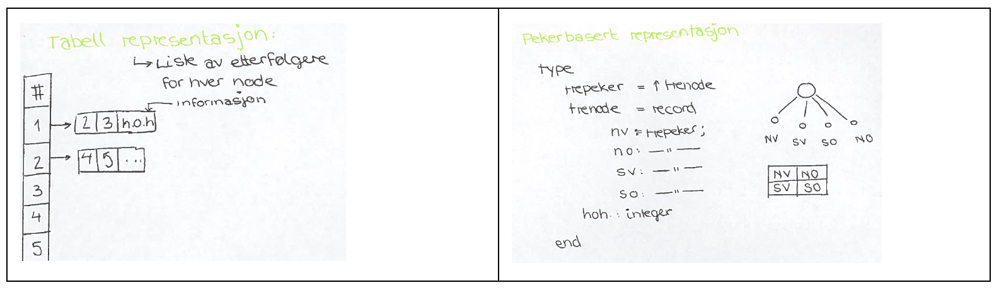

#### 08.04 Kjenne til preorder, inorder og postorder traversering av tre

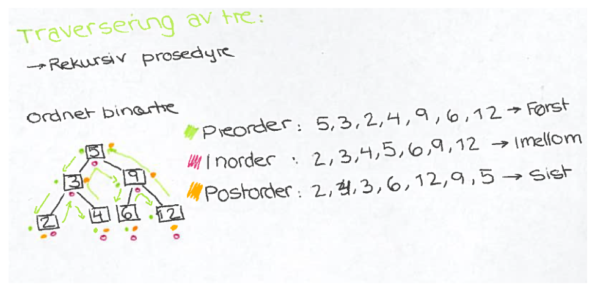

#### 08.05 Kjenne til oppbygging av 2-3-tre og B-tre

**2-3-tre:**

**B-tre:**

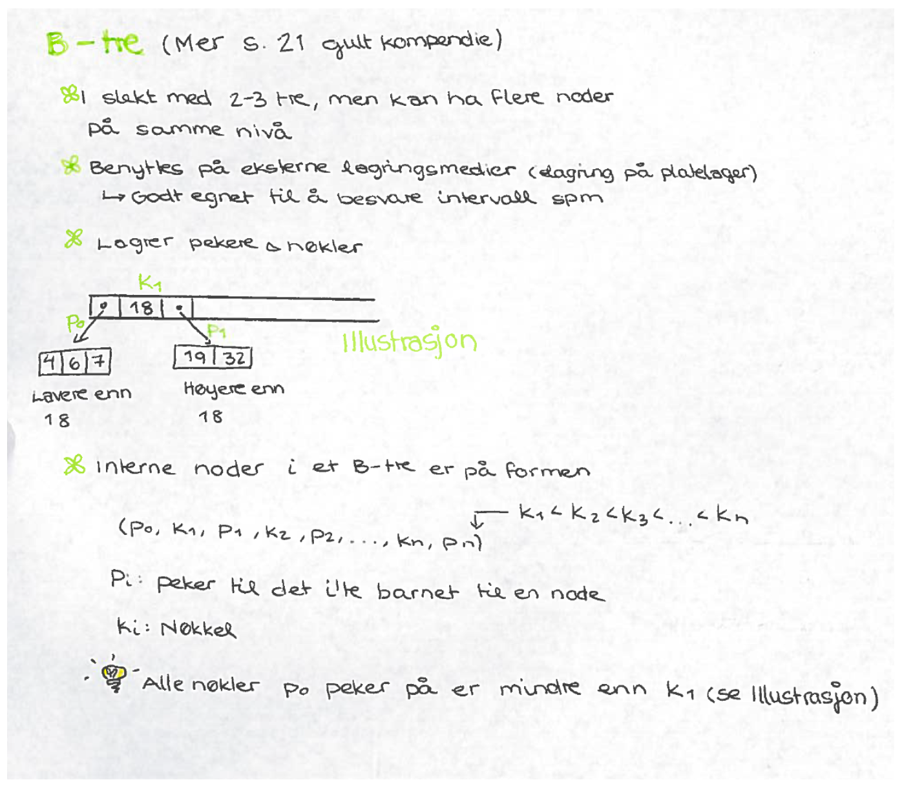

#### 08.06 Vite hva hashing er

**Hashing**: Brukes for å svare på spørsmål om medlemskap. Yttrykkes ofte som denne funksjonen: $a=h(k)$ der $a$ er adressen, $h$ er hashefunksjonen og $k$ er nøkkelen. Felles for alle hashefunksjoner er at de beregner disse maskinaddressene på bakgrunn av nøkkelverdien. Hashing er best når man klarer å uniformt fordele nøkler på adresser. 

eksempel: Anta at nøklene er personnummer i intervallet [1, 1000] og at hashfunksjonen setter a lik det siste sifferet i personnummeret. Dette gir oss 10 mulige adresser [0, 1, ··· , 9].

#### 08.07 Kunne bruke cellemetoden for oppdeling av et plan

**Cellemetoden**: 

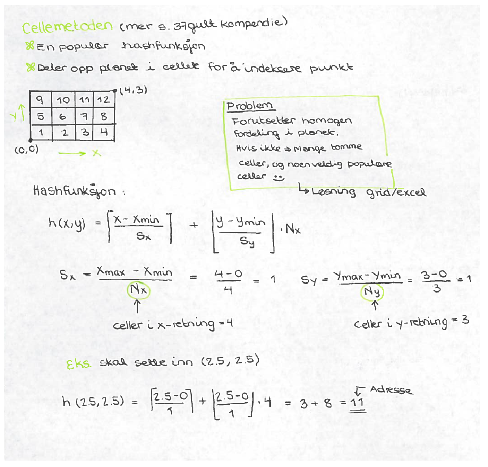

#### 08.08 Vite hvordan Morton-indeksering er bygd opp

**Morton-indeksering**:

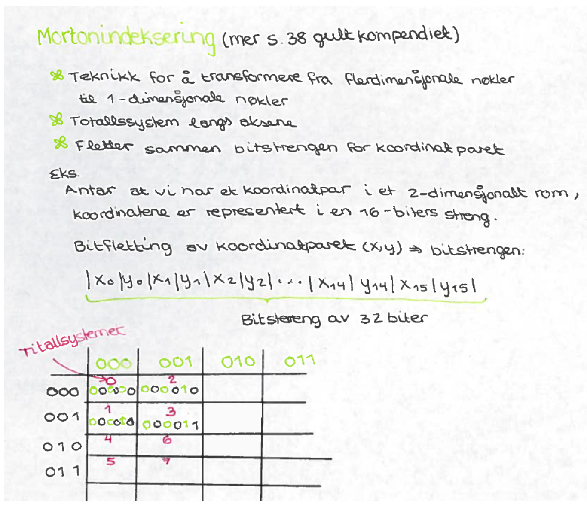

#### 08.09 Kjenne til prinsippet for quick-sort i planet

**Quicksort i planet:** Hvordan dele planet inn i bokser med like mange punkter i hver boks.

1. Finn tyngdepunkt (eller medianpunktet), 
2. del inn i fire 
3. Sorter
4. Gjenta

#### 08.10 Vite hva en peano-kurve er

**peano-kurve:** 

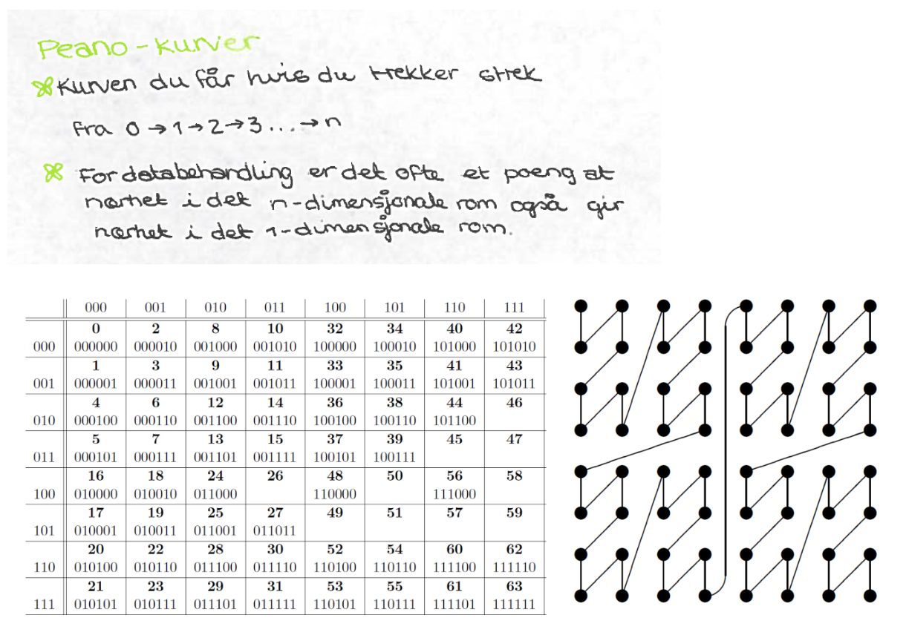

## 09 Romlige datastrukturer

#### 09.01 Kjenne til hva en romlig datastruktur skal kunne håndtere

**Oppdatering**: Skal kunne sette inn og slette i datastrukturen

**Romlige søk**: Søk basert på geometriske og topologiske kriterier til geografiske objekter

**Semantikk**: Søk basert på semantisk informasjon som er tilknyttet objektene

#### 09.02 Kjenne til klassifikasjon av kvadtre

**Kvadtre**: En klasse hierarkiske datastrukturer som har til felles at man rekursivt dekomponerer et 2D-objekt. 

Kvadtrær klassifiseres på følgende kriterier:

* De dataene treet skal presentere 
* Prinsippet for oppdelingen av rommet
* Om oppløsningen til treet er en variabel eller ikke

**Konvensjon for oppdeling:**

**Regulær firedeling**: Delelinjene skal halvere sine tilhørende intervall

**Irregulær firedeling**: Delelinjene legges der det er mest hensiktsmessig

#### 09.03 Vite hvordan man nummererer kvadblokker via Morton-indeksering

**Nummerering av kvadblokker med Morton-indeksering**: Indeksene av kvadblokker er morton-indekser i firetalls-systemet. Ved å følge konvensjonen for opptegning av kvadtrær får man av morton-indeksen en sti til den blokken man vil ha. Hvis blokken ikke er delt opp i det minste nivået vil man avslutte indeksen med nummeret til den minste elementærruta. 

Riktigheten av dette framkommer ved å se på sammenhengen mellom det binære tallsystemet og firetallsystemet. Konvertering til firetallsystemet skjer ved å dele bitstrengen i grupper av 2 biter, men 2 biter er jo nettopp resultatet av fletting av bitene $x_i$ og $y_i$. Siden mortonindeksen framkommer ved en slik fletting, vil vi ved å tolke bitstrengen til mortonindeksen i firetallsystemet få stien til vedkommende kvadblokk.

#### 09.04 Finne minste høyde til et kvadtre når antall løvnoder er kjent

**Minste høyde i et kvadtre**: I et regulært kvadtre med N løvnoder er det minste høyde treet kan ha:
$$
h_{min}=\lceil \log_4 N\rceil
$$
Man runderopp fordi hver påbegynte firedeling i et nytt nivå vil øke høyden på treet. Minstenivået vil oppnås når treet er balansert. 

#### 09.05 Finne maks høyde til et kvadtre når minste rueside og sidekant er kjent

**maks høyde i kvadtre**: For å kunne regne ut makshøyde må man vite hvor lite man kan partisjonere områdene, $d$, og og det kartlagte størrelsen på området er gitt $s$. 

Den maksimale trehøyden er da gitt ved:
$$
h_{maks}=\lceil\log_2(s/d)\rceil
$$

#### 09.06 Vite hva man mener med posisjonskode

**Posisjonskode:** Den fullstendige nummerkoden for en blokk er mortonindeksen pluss en nivåangivelse, dette for å gi en entydig posisjon. Denne entyde posisjoneringen kalles for en posisjonskode. 

Posisjonskode kan benyttes for å lage trær som ikke har pekere, siden posisjonskoden gir en unik indeks for hver blokk. Det er i denne forbindelse nærliggende å kun lagre løvnodene til i treet, denne typen kvadtrær kalles lineære kvadtrær. 

#### 09.07 Vite hvordan et lineært kvadtre er bygd opp

**Lineære kvadtrær**: Posisjonskode kan benyttes for å lage trær som ikke har pekere, siden posisjonskoden gir en unik indeks for hver blokk. Det er i denne forbindelse nærliggende å kun lagre løvnodene til i treet, denne typen kvadtrær kalles lineære kvadtrær. 
Dette gjøres hvis man har et svært kvadtre man ikke kan holde i primærminnet, ved å uttrykke det som et lineært kvadtre blir det enklere å manipulere. Man har ingen enkel måte å slå opp blokker med bestemte nummer, for å minske søketiden bruker man noen teknikker

* Sortert liste med binærsøk
* 2-3-tre over posisjonskodene (Kan være lurt å kjede løvnodene sammen)
* Ved store datamengder på sekundærlager er $B^+$-tre et fornuftig valg. 

#### 09.08 Kunne lage en algoritme for å finne naboer til et kvadtre

**Sidenaboer**: Sidenaboer til en blokk er blokker som deler en rett side. Står i N, S, Ø, V i forhold til blokken.  

**Hjørnenaboer**: Hjørnenaboer til en blokk er blokker som møtes i hjørnene, står i NV, SV, NØ, SØ. VIktig å merke seg at man kun sammenligner blokker av samme størrelse, så naboene må enten komponeres eller dekomponeres for å matche størrelsen til blokken. 

**Algoritme**: Algoritmen er ganske grei, sidenaboen til en blokk defineres utifra hvilken blokk det gjelder og hvilken nabo det gjelder. Termineringskriteriet er når man finner en felles forgjenger. Sammenhengene finner man i tabellene under: 

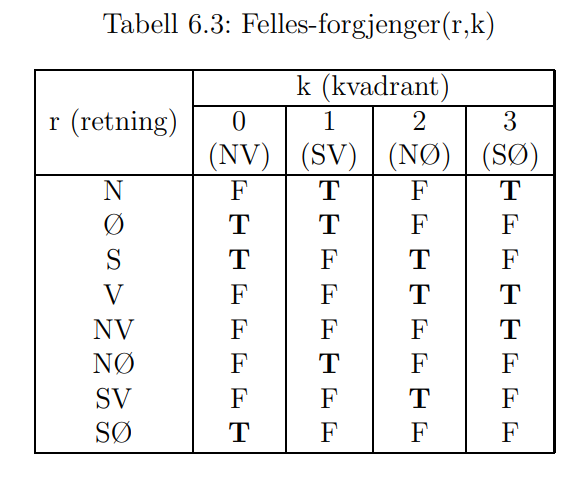

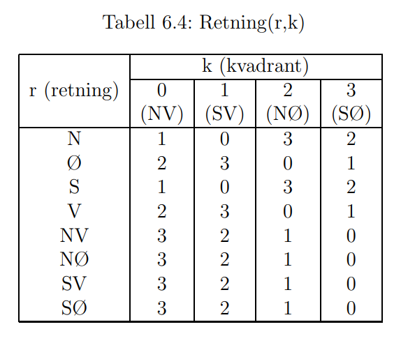

Steg: 

1. Dekomponer problemet til delproblemer av sidenaboer
2. Velg sidenabo
3. Løkk gjennom mortonindeksen baklengs, terminer hvis man finner felles forgjenger
   - Slå opp i tabell som tilsvarer den retningen man vil gå i, basert på hvilken posisjon i morton-indeksen man står på
4. Gjenta steg 3 med hensyn på nylig generert sidenabo hvis man har et hjørnenabo-problem

**Forutsetningen for at det fungerer**: Svart magi mann, kan bruke mer tid på å skjønne dette. 

- Hvis man ikke finner en felles forelder betyr traversering opp i mortonindeksen fortsatt at naboblokken direkte grenser med originalblokken
- Iterasjonene koder et relativt forhold, men blir entydig først når man finner en felles forelder. 

#### 09.09 Vite hva et PR-kvadtre er og hvordan sette inn eller slette et punkt

**PR-kvadtre**: Point-Region-kvadtre, er et requlært kvadtre som holder koordinatene til 0-dimensjonale objekter i løvnodene. 

Intern lagring: Det lagres maksimalt et punkt i en løvnode. 

Ekstern lagring: Lagerkapasiteten til en løvnode dimensjoneres etter lagringsmediets karakteristika. Hensiktsmessig karakteristika er å velge lagringsmediets minstre adresserbare enhet.

**Innsetting**: Ganske rett frem. Hvis kapasiteten til en løvnode blir fylt, splittes løvnoden i fire nye kvadranter, altså blir det dannet fire nye løvnoder og den gamle løvnoden blir en intern-node. Hvis kapasiteten til en av de nye løvnodene også er fylt, splitter man rekursivt helt til det ikke er tilfelle. 

- problem: Hvis punkter er svært nære hverandre kan man ende opp med å ikke ha høy nok oppløsning til å få et punkt innenfor et kvadrant. 

**Sletting**: Også ganske rett frem, siden all data ligger i løvnoden. Hvis forgjengeren $p$ til en slettet løvnode peker til bare en løvnode kan den løvnoden

#### 09.10 Kjenne til en effektiv algoritme for å finne nærmeste nabo i et PR-kvadtre

**Ordinært skall**: Skall kan defineres som følgende
$$
S_{i+1}=\{q\space|\space q \in N(S_i); i\geq 0\}
$$
 Der $N(S_i)$ er funksjonen som definerer om en blokk er en nabo, i PR-kvadtrær er det kun løvnodene som er av interesse, og siden et PR-tre kan være irregulære kan en blokk ha flere enn 4 sidenaboer. 

**Algoritme for nærmeste punkt**: Formalisert, finne det punktet R som ligger nærmest P. 

1. Start med skall $S_0$, som definerer blokken $P$ havner innenfor. Sjekk om det ligger noen punkter innenfor dette skallet. 
2. Søk så videre utover til man finner et punkt $R$. Definer et nytt minimalt skall $S_i^{'}$ som er alle blokker i $S^{'}$ i tillegg til alle blokker som overlapper med sirkelskiven $U(P, \epsilon)$ der $\epsilon$ er distansen mellom $P$ og $R$
3. Søk gjennom $S'$ og finn nærmeste punkt i den mengden. 
4. Ferdig. 

#### 09.11 Vite hva et MX-kvadtre er

**MX-kvadtre**: 'MX' er en forkortelse av Matrix, og har treet har lingnende egenskaper til et PR-tre. Den eneste forskjellen er at punktene direkte assosieres til den blokken den er i. De direkte punktene lagres. ikke. 

Fungerer bra som modell hvis så lenge punktene har en viss minsteavstand og nøyaktigheten er tilstrekkende. 

Det har ingenting å si hvilken rekkefølge punkter settes inn. 

#### 09.12 Vite hva som kjennetegner et PM-kvadtre og et PMR-kvadtre

**PM-kvadtre**: Ligner også veldig på PR-kvadtrær, bortsett fra at PM-kvadtrær lagrer informasjon om linjer, istedenfor punkter. Språklig hadde det gitt mening å kalle det et PL-tre istedenfor. Samet snakker om variantene PM_1, PM_2, PM_3, PM_4 og PMR-kvadtre. 

**PM_3**: En løvnode kan inneholde et knekkpunkt, men det er ingen øvre grense på hvor mange linjesegmenter den kan inneholde, altså kan et punkt ha uendelig mange linjesegmenter som går utifra en. 

En node i PM_3 har følgende informasjon:

- Felt som angir om en node er intern-node eller løvnode
- Peker til nodens etterfølgere (hvis intern-node)
- Felt som definerer størrelsen på kvadruten samt koordinatene til sentralpunkt
- Liste over linjesegmenter som befinner seg helt eller delvis innenfor blokken. 

**PMR**-kvadtre: I et PMR-kvadtre settes splittkriteriet etter antall linjesegmenter i en kvadblokk. Pågrunn av at uendelig mange linjesegmente rkan stråle ut ifra et punkt vil en oppdeling i stadig mindre ruter ikke garantere at splitt-kriteriet tilfredsstilles. 
Prinsippet om overløpsblokker introduseres, når en blokk blir full splittes den kun en gang, dersom den fortsatt er full legges overskytende informasjon seg i en overløpsblokk. 

#### 09.13 Kjenne til hvordan man kan legge inn informasjon om topologi i et PM-kvadtre

**Topologisk informasjon i PM-kvadtre:** Utvider nodene i treet med informasjon om topologi. 
topologisk informasjon:

- Hvilke polygon et linjesegment tilhører
- Hvilke areal som ligger til høyre og venstre for et linjesegment(Dersom et linjesegment har samme areal til høyre og venstre for seg betyr det at det ligger innenfor samme areal (ikke nødvendigvis?))

**Kjede**: Korte linjesegmenter, som betyr tette punkter. Det å gruppere linjesegmenter med felles topologi kalles en kjede. Kjeder defineres gjerne fra knutepunkt til knutepunkt med en restriksjon på et kjede kun kan være grenselinje mellom to polygoner, og at kjedene ikke kan overlappe hverandre. Disse forutsetningene betyr at kun endepunkter på kjeder kan være forgreiningspunkter. 

Foreslått datastruktur:

1. Mengden av alle polygoner
2. Der et polygon er en mengde av kjeder
3. Der en kjede er en mengde av linjesegmenter

I en kvadblokk skal det finnes informasjon om hvilke kjeder som befinner seg helt eller delvis innenfor blokken, men det kan også være lurt å lagre hvilke linjesegmenter det er snakk om også. Dette gjøres enkelt ved å oppgi delmengdeindeksene til kjedene. 

#### 09.14 Vite hva et Region-kavdtre er

**Region-kvadtre**: Et region-kvadtre er et kvadtre for rasterkart. Man splitter kvadblokkene helt til hver blokk inneholder ruter av samme farge. Gitt et svart-hvitt bilde kan man redusere lagringsplassen betraktelig ved å kun lagre svarte områder i et lineært kvadtre.

#### 09.15 Vite hva et punktkvadtre er og hvordan punkt settes inn

**Punktkvadtre**: Datastruktur for 0-dimensjonale objekter. Delelinjene til treet er parallelt med koordinataksene og går gjennom datapunktene. Siden en node i treet bare inneholder inntil et datapunkt er det ikke bra som platelager. Vi snakker kun om en intern datastruktur. 

**Innsetting**: Innsetting følger en logikk som minner om PR-kvadtre Vær konsistent hvis en node ender på linje med en annen node, i boka går man mot øst.

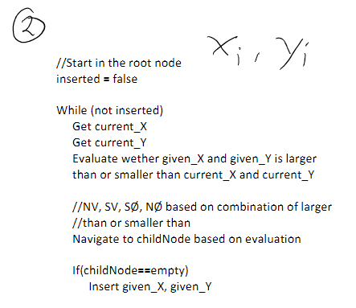

#### 09.16 Vite forskjellen mellom et perfekt balansert og et optimalisert kvadtre

**Balansert/optimalisert**: Total stilengde er så liten som den aktuelle punktmengden tillater

**Perfekt balansert**: I et perfekt balansert punktkvadtre er et nytt nivå ikke påbegynt før alle tidligere nivåer er fylt helt opp. Løvnodene i treet tilhører derfor enten nivå $i$ eller nivå $(i + 1)$.

Hierarkisk sortering kan anvendes for å produsere balanserte trær, gitt at det ikke tas bort eller legges til punkter. Prosedyren blir å kjøre hierarkisk sortering, før man setter inn punktene i sortert rekkefølge. Den mest gunstige punktfordelingen er at hver nye fordeling produserer 4 nye kvadranter, da blir den perfekt balansert. 

#### 09.17 Kjenne til en effektiv algoritme for nærmeste nabo-søk i et punktkvadtre

**Søk etter nærmeste punkt**: Si at vi har et punkt $P$ og vil finne nærmeste punkt $Q$. Den euklidske distansen mellom $P$ og $Q$ uttrykkes som $\varepsilon$. Sirkelskiven med senter i $P$ og radius $\varepsilon$ benevnes $U(P, \varepsilon)$.

Når man står i en vilkårlig node, regn ut avstanden fra noden til $P$, er det nærmere enn $Q$ bytter man ut $Q$ og $\varepsilon$. Neste steg er å evaluere hvilke av de 4 kvadrantene til noden som kan inneholde et punkt som er enda nærmere. Det vil være et sted mellom 1 og tre kvadranter man må sjekke, kriteriet er hvilke områder $U(P,\varepsilon)$ overlapper. 

Det å gå gjennom alle noder/punkter er egentlig ikke akseptabelt, derfor må vi finne en god måte å regne en startverdi på $\varepsilon$. 

- Enten innføre en startverdi basert på antagelse
- Eller, traverser stien til den blokka $P$ tilhører, og for hver node i den stien, oppdater $Q$ og $\varepsilon$ om nødvendig. 

Besøk så de resterende blokkene som ble identifisert med sirkelen $U(P, \varepsilon)$

#### 09.18 Kjenne til prinsippet for kD-tre og adaptivt kD-tre

**KD-treet**: Store likheter med punktkvadtreet. Forskjellen ligger i at et kvadtre kan dele planet i 4, mens KD-treet kun kan dele i to. KD står for k-dimentional, i teorien kan KD-trær brukes til å splitte k-dimensjonal rom. Innsetting og optimalisering er mye likt som kvadtrær. 

eksempel: 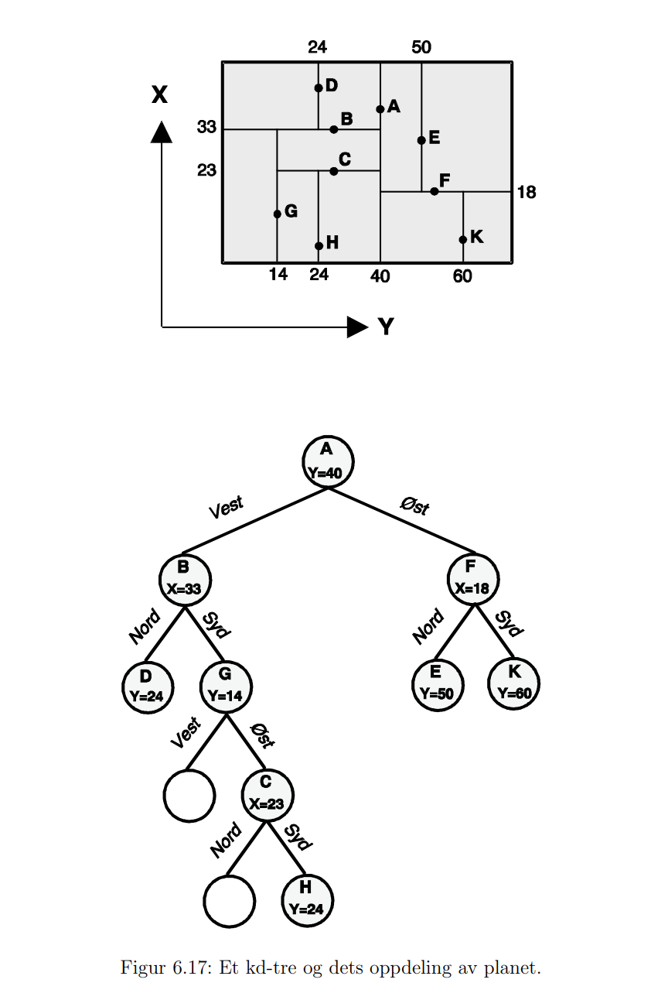

**Adaptivt kd-tre**: I et adaptivt kd-tre utvides noden til selv å definere hvilken akseretning delelinjen går i. Dette gir potensiale for et lite tre, ved at man prøver å velge en deling i akseretningen som gir så like delmengder som mulig. 

#### 09.19 Kjenne til prinsippet for stripetre

**Stripetre**: Er en hierarkisk representasjon av 1-dimensjonale objekter. Realiseres ved en gradvis tilnærming av kurvesegmenter med omskrivende rektangler. Uttrykkes som et binærtre, der treet etableres ved å legge et omskrivende rektangel rundt hele strukturen. 

Rektangelet legges slik at to av dets sider blir parallelt med den rette linjen mellom objektets endepunkter. Avstanden mellom linja til endepunktene og de 2 punktene (minst) som er lengst unna definerer toleransemålet til modellen. Hvis det er over toleranseverdien splitter man kjeden på det punkte med lengst avstand. Dette gjøres helt til tolreansemålet kommer under toleranseskranken. Intervallets mest karakteristiske punkt blir med denne metodologien valgt. 

Vil man heller ha et så balansert tre som mulig velger man punktet i midten, men da vil man potensielt gjøre flere splits. 

**Operasjoner:** Stripetrær er gode på å svare på spørsmål om linjer, skjæringspunkt, finne ut om to linjer skjærer hverandre osv. Med de omskrevne firkantene kan man enten bestemme om det er umulig at de har skjært hverandre, at de må ha skjært hverandre og at det er mulig at de har skjært hverandre. 

**Egenskaper**: Prefikstraversering med stans i rekursjon når rektangler når en minstebredde $t$ vil føre til en forenklet 1-dim objekt, der $t$ beskriver graden av forenkling. 

Invariant ovenfor rotasjon, derfor **en fordel ovenfor PM-kvadtrær**. 

#### 09.20 Kjenne til prinsippet for Excell, og kunne bruke hashfunksjonen for denne

**Excell**: Excell er en forbedring av cellemetoden. Utvidelse av extendible-hashing i n-dimensjoner. 

Excell baserer seg på en regulær oppdeling av planet i rektangler og en tilordning av databøtter til rektanglene. Hashfunksjonen avbilder alle tupler innenfor et rektangel på rektanglets unike adresse, akkurat som cellemetodens hashfunksjon. 

Viktig unntak: EXCELL har en strategi for å tilpasse seg endringer i datavolumet, samme strategi som extendible hashing. Består av to elementer. 

- Naborektangler kan legge sine data i samme databøtte, antall rektangler dobles dersom datamengden blir tilstrekkelig stor. 

Ved overløp gjøres følgende tiltak:

- Splitting av databøtte (Splitter fordi naboer deler databøtte)
- Splitt av katalogen, har nå kapasitet til å referere til dobbelt så mange bøtter. 
  Alternerer hvilken vei rektanglene splittes. 

#### 09.21 Kjenne prinsippet for Gridfile, og kunne bruke hashfunksjonen for denne

**Gridfile**: Ligner på Excell, bare at på overløp som fører til at man må splitte katalogen deler man kun den horisontale eller vertikale stripen som rektangelet er en del av. 

Det gjør at Gridfile er bedre tilpasset til å vise informasjon som er ujevnt fordelt. Man gir opp Excells enklere adresseringssystem for å få til dette, Gridfile bruker en skala i hver av akseretningene, som angir koordinatene til til delelinjene. Denne skalaen realisres som en en-dimensjonal array. 

#### 09.22 Kjenne til prinsippet for MX-CIF kvadtre

**MX-CIF**: Opererer på en mengde av rektangler, assosierer hvert rektangel R med den minste kvadblokk som inneholder (eller dekker) R. Instansierers rekursivt helt til en kvadblokk ikke lenger inneholder et rektangel, eller til man oppnår en minstestørrelse. 

Dekker eller inneholder her henholdsvis $r_7$ og $r_6$ av de topologiske relasjonene. 

#### 09.23 Kjenne til prinsippet for R-tre og hvordan denne er bygd opp

**R-tre**: Avledet av B-tre, er en hierarkisk datastruktur. Vilkårlige geometriske objekter representeres i R-treet som n-dimensjonale rektangler. En node i treet tilsvarer det minste n-dimensjonale rektangelet som inneholder dets etterfølgere. 

Et objekt blir representert i treet ved det minste rektangel det er en delmengde av. 

**Regler for forming**: 

1. Alle løvnoder skal ligge på samme nivå
2. Hver inngang i en løvnode er et 2-tuppel av formen $(R, O)$, hvor $R$ er det minste rektanglet som omslutter objekt $O$. 
3. Hver inngang i en intern-node er et 2-tuppel av formen $(R,p)$, hvor $R$ er det minste rektangel som omslutter rektanglene i etterfølgeren som pekes på av pekeren $p$

**Innsetting**: Den aktuelle løvnoden finnes ved å traversere R-treet fra roten, og for hver node velge det subtreet som kan omslutte objektets omskrivende rektangel. Så snart løvnoden er funnet, undersøkes om innsetting av det nye rektanglet vil gjøre at noden går full.

Splitting gjøres utifra to kriterier

1. Enten minimere det totale arealet til de omskrivende rektanglene
   - Skal minimalisere sjansen for at noden blir besøkt
2. Minimalisere det totale overlappingsområdet
   - Minimere sannsynligheten for at begge nodene må besøkes

Splitting er ikke noe man burde bruke mye tid på å optimalisere, ettersom det er kostbart og ikke forbedrer algoritmen så veldig. 

**Romlig søk**: litt kostbart ettersom flere omskrivende rektangler kan omslutte samme objekt selv om et objekt kun kan eksistere i et rektangel. 

#### 09.24 Vite hvordan et R+-tre skiller seg fra et vanlig R-tre

**$R^+$-trær**: Skiller seg fra R-tre ved at interne noder ikke skal overlappe hverandre. Dermed kan løvnoder forekomme flere steder og må ikke være omsluttet av foreldernoden sin. Dette gjør tredybden større, men effektiviserer søk. 

$R^+$ sliter ved at man mister B-treets ytelse, uten kompliserte innsettings- og slettingsrutiner, men empiri viser fortsatt at den har god performance. 

## 10 Representasjon og algoritmer

#### 10.01 Vite hva som er minste geometriske element i ulike dimensjoner

**1 dimensjon**: 1-simplex, linja 6 topologiske relasjoner

**2 dimensjoner**: 2-simplex, hvor man antar diskrethet. Trekant, 9 topologiske relasjoner

**3 dimensjoner**: 3-simplex, tetraeder

#### 10.02 Kjenne til problem som kan oppstå ved diskretisering av data

**Diskretisering**: Overføre modell-data til typer som er i diskret rom. Euklidisk rom er bygd opp av reelle tall og er derfor topologisk pakket, uendelig presisjon. 

**Problemer:**

- endelig presisjon, ved diskretisering mister man presisjon
- Strukturer som ikke former geometriske domener må tilpasses, foreksempel at krysningspunkt må tilpasses et grid-punkt. 
- Jo flere krysninger, jo mer forskjøvet blir linja. 

**Green - Yao**: sets a limit for the total drift, we now have a process that is both well defined and has a bounded error accumulation. 

#### 10.03 Vite hva man mener med spagettidata

**Spagettidata**: Representerer en plan konfigurasjon av punkter, buer og områder. Geometri er representert som et set av lister av rette linjesegmenter. Det er ingen eksplisitt topologisk representasjon. 

Spagetti gir altså den grunnleggende sammenhengen i en romlig konfigurasjon, men få andre romlige relasjoner er tilstede. Punkter gjentas flere ganger hvis de tilhører flere lister, altså gjentas data. 

#### 10.04 Kjenne til datastrukturen dobbel-linket kantliste (DCEL)

**DCEL**: Komplett presentasjon av topologien til en koblet planar graf. Den bryr seg ikke om embeddingen (polygoner, koordinater, kjeder) men fokuserer på de topologiske relasjoenne mellom noder, kanter og face. 

#### 10.05 Vite hva som er forskjellen mellom et sterkt forbundet arealobjekt og et svakt forbundet arealobjekt

**Object-DCEL**: Områder defineres som lukket av de rette kantene fra høyre, skiller mellom svake, og sterkt bundede arealobjekter

**Svakt bundet**: Mulig å transformere en mengde $X$ til å være flere ikke-sammenhengende mengder ved å fjerne et endelig antall punkt

**Sterkt bundet**: Ikke svakt bundet.

 

#### 10.06 Kjenne til "Wing-edge" representasjon

**Wing-edge**: Variant av DCEL, innfører begrepet med og mot klokka for å definere kanter som er koblet til. 

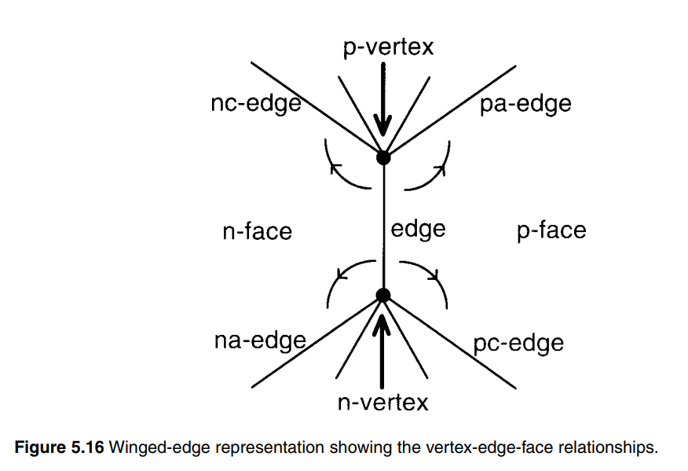

#### 10.07 Vite hva regulerte mønster det Euklidiske plan kan deles i

**Regulerte mønster**: Dekking av overflate med ikke-overlappende polygoner. Et regulært polygon er et polygon som har at alle kanter er like lange og alle interne vinkler er like. 

Et regulert mønster er da at alle deltakende polygoner er regulære og like, samt at alle nodefigurer er like. 

Tre mønstre som er mulige:

- Likesidede trekanter
- Kvadrater
- Hexagoner

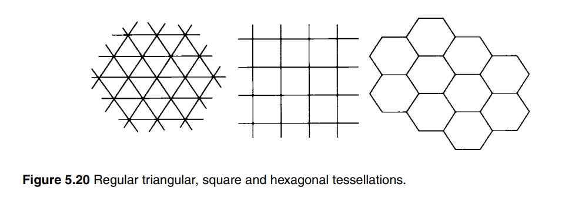

#### 10.08 Kjenne til algoritme for avstand punkt - linje

Algortime: 
$l=\{(x,y)|ax+by+c=0\}$
$p=(X,Y)$

$distance(p,l)=|aX+bY+c|\sqrt{a^2+b^2}$

#### 10.09 Kjenne til algoritme for å finne representasjonspunkt

**Representasjonspunkt av et polygon**:

Gitt et regulært Polygon med nodene $p_1, p_2,...,p_n$, så er representasjonspunktet:

$centroid(P)=(p_1+...+p_n)/n$

#### 10.10 Kjenne til algoritme for å finne areal av et polygon

Gitt et regulært Polygon med nodene $p_1, p_2,...,p_n$, så er formelen for arealet gitt ved:

$area(P)=(p_1\times p_2+p_2\times p_3+...+p_{n-1}\times p_{n}+p_n\times p_1)/2$

#### 10.11 Kjenne til algoritme for å finne hvilke side et punkt ligger på i forhold til en linje

#### 10.12 KJenne til en algoritme for å finne om et punkt er innenfor et polygon

**Konvekst polygon:** Gitt at punktene i et polygon er ordnet counter-clockwise$side(p,p_1,p_2)=side(p,p_2,p_3)=...=side(p,p_n,p_1)=1$

**Ikke-konvekst polygon**:

**Semilinje**: Tegn en rett linje fra punktet, tell antall ganger den **krysser** en polygonkant, odde-tall: inne, partall: ute

**Winding number**: Se for deg en observatør i p som skal se på alle punktene i polygonet p, hvis han spinner ett odde antall ganger rundt sin egen akse er polygonet inne. 

#### 10.13 Kunne lage trekantnettverk i et polygon

**Grådig algoritme:** I hvert steg, velg den korteste interne diagonalen. Worst case kompleksitet er O(n^3) fordi man potensielt må sjekke n^2 kanter og sjekke valgt kant opp mot de n andre kantene for å finne potensielle overlapp.

**Monotone polygoner:** 

Regulariser polygon 

- del opp i monotone polygon 
  - Få to monotone poly-linjer (projeksjon av polygon gir samme rekkefølge på punkt i poylinjene)
- Fjerne ekstra kanter
- Triangulere
  - Alle noder skal ha en kant på skrå ned
  - Alle noder skal ha en kant på skrå opp (NB ingen kryssing)

#### 10.14 Kjenne til en fremgangsmåte for vektorisering av rasterdata

1. Thresholding: Lag et svarthvitt binærbilde utifra et multiskala raster
2. Smooth: Fjern støy, kan foreksempel gjøres med et smooth-filter
3. Thin: Tynn linjer så de bare er en pixel bred
4. Chan code: Transformer det tynnede rasteret til ett sett av lenkede pixler, hvor hver representerer en bue
5. Reduser kjedene til vektorer, basert på toleranse og nøyaktighet. 

#### 10.15 Vite hvordan Douglas-Peucker og Langs algoritme fungerer

**Douglas-Peucker**: Mye av den samme logikken som et stripetre, global algoritme, legger derfor bare ved et bilde som illustrerer: 

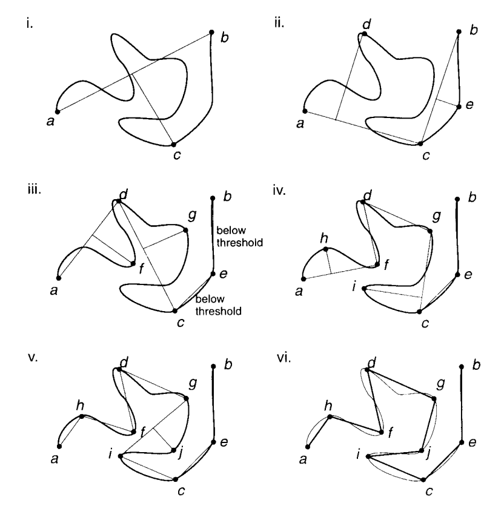

**Lang**: Lokal algoritme, ser på innsetting av punkter til kjeden. 

## 11 Generalisering

#### 11.01 Kunne definere begrepet kartografisk generalisering

**Kartografisk generalisering**: 

Tilpasse kartets innhold på en slik måte at informasjonen blir oversiktlig og lettlest.

Utvelgelsen og den forenklede representasjonen av detaljnivå som er passende til skala og bruksområde til kartet

> ”...the selection and simplified representation of detail Appropriate to the scale and/or purpose of the map.”

#### 11.02 Kjenne Douglas-Peuckers algoritme for punkttynning

Jaaa, sjekk **10.15**

#### 11.03 Kjenne til ulike strategier for lagring i databasen av kart i ulik målestokk

**Målestokk-tilpassede databaser**: En database til hver målestokk

**Målestokk-uavhengige databaser**: En database med alle målestokkene

**Pseudo-målestokkuavhengige databasar**: En database der man har overgangsinfo mellom målestokkene

#### 11.04 Vite hva regelbasert generalisering er

**Regelbasert generalisering**: Formalisering av hva kartografen har av kunnskap. Sees på som et beslutningstre der de ulike veiene fører til en hendelse eller generaliseringsprosess. 

#### 11.05 Kjenne Shea og McMaster sine generaliseringsoperatorer

**Simplification**: Foreksempel utvalg med minstemål, ikke inkluder det som blir for smått. 

**Smoothing**: Fjerne høyfrekvens, glatte linjer, kurver etc. 

**Aggregation**: Kombinere objekter til større, sammenslåtte objekter

**Amalgamation**: the action or process of uniting or merging two or more things, i eksempelet så blir to linjer tynnet ut

**Merge**: På illustrasjonen 'merger' de 4 linjer til 2. 

**Collapse**: Foreksempel omdanne areal til punkt. 

**Refinement**: Forenklet trestruktur brukes i eksempelet. 

## 12 Dynamiske kart og multimedia

#### 12.01 Vite hva som kjennetegner dynamiske kart

**Dynamiske kart**: Kart som inneholder dynamiske variabler. Ikke-statisk. 

#### 12.02 Kunne forklare de 6 dynamiske variablene

**Visningstidspunkt**: 

**Varighet**:

**Rekkefølge**: Ordning etter tid eller rekkefølge 

**Endringsgrad**:

**Frekvens**:

**Synkronisering**:

#### 12.03 Kjenne til egenskapene til de dynamiske variablene

#### 12.04 Kjenne til hva som er viktig når tid skal visualiseres i en kartanimasjon

- Visuelle variable: Rekkefølge, variablens form kan tilpasses for en personlig tidsindeksering, må være ulik variabelen for hovedfenomenet
- Fokus må være på hovedfenomenet
- Periferien er der man skal oppfatte tidsvariablen, mer sensitivt for gråtoner enn farger
- Øyebevegelse må reduseres. 

#### 12.05 Kjenne litt til mer avansert bruk av tegnforklaring i interaktive kartanimasjoner

- Symbolene i tegnforklaringen er interaktive

- En skygge av symbolet kan flyttes rundt

- Skyggesymbolet kan sammenlignes med et symbol på kartet

- En voksende stolpe er symbol på tid

- Når “skyggesymbolet” overlapper kartsymbolet aktiverer den ny informasjon i tidsstolpen

  **[who knows, må titte nærmere på dette]**

#### 12.06 Kjenne til noen eksempler på “lydvariabler”

- Plassering
- Lydstyrke
- Toneart
- Toneleie
- Timbre
- Varighet
- Endringsgrad
- Rekkefølge
- Økning/reduksjon

## 13 Brukergrensesnitt

#### 13.01 Kjenne til hvordan folk er i interaksjon med en datamaskin

- Er applikasjonen intuitiv eller komplisert?
- Er bruken tilfredsstillende eller frustrerende?
- Hvordan kan datamasskinen/applikasjonen være tilgjengelige for alle? (språk, funksjonshemming)
- Til hvilken grad kan interaksjonen standardiseres?
- Er datamaskinen brukervennlig?

#### 13.02 Kjenne til hvilke sanser som kan brukes til denne interaksjonen

Visuelt: 

- syn

Følelse:

- Haptic feedback

Audio:

- Lyd

Smak, Balanse, Bevegelse

#### 13.03 Kjenne ulike typer "input device"

**Input device**: Spillkonsoll, joy-stick, mus, touchpad, ratt, tastatur, tegnebrett, mikrofon, bevegelsessensor

#### 13.04 Vite hva eksplisitt og implisitt input er

**Eksplisitt**: Skrive, trykke

**Implisitt**: GPS, Gyroskop

#### 13.05 Vite hva som kjennetegner et intuitivt brukergrensesnitt

Lett å bruke, lett å lære.
Visibility: synlig
Mapping: naturlig tilordnede egenskaper
Affordance: innbyr til handling
Feedback: ting skjer
→Her kan vi kanskje bruke Don Normans prinsipper fra MMI? :) 

#### 13.06 Kjenne en del typer grensesnitt og deres egenskaperForklarende grensesnitt (expressive): 

Ekspressive grensesnitt kan spesifisere mer presise kommandoer enn et intuitivt grensesnitt.
En ønsker å ha en kombo av disse to, men det er vanskelig.

Kommandolinje: ikke intuitivt, må læres
Meny: 	Kommandoer ordnet i logiske grupper, mindre expressive
Skjema: Svare på spesifikke spørsmål, litt mer intuitivt
WIMP (Windows, Icons, Menus, Pointers): gjør menyen mer intuitiv, skrivebordsmetafor 
Berøringsskjerm: overføre analoge hendelser, intuitiv
Naturlig språk: ny ‘kanal’, intuitiv, usikker overgang analog-digital, kan være tvetydig
Fra ekspressive til intuitive

**Spesielt for GIS**

Kartografisk grensesnitt

- Forenkling
- Klassifisering
- Generalisering
- Fokus på viktige sammenhenger, ikke irrelevante detaljer

#### 13.07 Vite hva som kjennetegner geovisualisering

**Geovisualisering**: Vitenskapeilig visualisering av geografiske fenomener
Bruk av 
Dynamikk
Interaktivitet
Multimedia
‘Linking’ av fenomen
The process of using computer systems to gain insight into, and understanding of geo-spatial information

#### 13.08 Kjenne en del effekter som kan brukes til å framheve "dybde"

- Analytisk skygge (Regne på lyskildeprojeksjon av trekantflater foreksempel, telle inn på hvor refleksivt, ruglete og lysrikt et element er)
- Relativ størrelse: Store ting er nærmere enn små ting, har noe med øyets sentralprojeksjon å gjøre
- Lineært perspektiv: Lineær projeksjon, jo mer samlet linjene blir, jo lenger unna. 
- Gjenkjenning: Assosierer hvor stort et objekt er 
- Tildekking: At objekter står i forhold til hverandre med overlapping
- Fokus
- Tekstur-gradient
- Skygge

#### 13.09 Vite hva man mener med haptiske grensesnitt

**Haptisk grensesnitt**: Grensesnitt som bruker bevegelse for å formidle informasjon. Foreksempel hjemknappen på iphone som sier ifra om den er trykket ved å vibrere telefonen. Eventuelt playstation-kontroller som vibrerer hvis du blir drept. 

#### 13.10 Kome med eksempler på teknikker for dynamisk spørring mot GIS

**Zoom**		- til aktuell info
**Panorer**	- til aktuell info
**Fokuser**	- sett skrankeverdi for det du skal studere
**‘Brushing’**	- pek på en detalj og få info

#### 13.11 Kunne liste opp ulike bruk av GIS rangert etter enkelhet på interaksjon

#### 13.12 Vite hva brukbarhet til en applikasjon kan måles etter

**Usability**: Tatt fra programvarearkitektur-pensum

#### 13.13 Ha oversikt over noen metoder for å lage brukergrensesnitt

## 14 Triangulære irregulære nettverk

#### 14.01 Kjenne til aktuelle geometriske og topologiske element i en datastruktur for TIN

- Kanter og noder trenger å vite hvilke trekanter den tilhører
- Trekanter trenger å vite hvilke naboer den har

#### 14.02 Kjenne til en kant/trekant datastruktur

**Side-trekant-strukturen**: 

En kant kan være grensen for ett eller to triangler
Antall direkte naboer til et triangel er enten null, en, to eller tre

**Kant-tabell (edge table)**: Oversikt over de numererte kantene, og hvilke trekanter den grenser til. 

**Trekant-tabell**: Oversikt over trekantene i strukturen, og hvilke sider som definerer den. 

Denne strukturen lar en raskt navigere i nettverket. 

**Redundant**: Man kan utlede T-tabellen direkte fra E-tabellen, derfor inneholder denne strukturen mer data enn helt strengt nødvendig. 

#### 14.03 Skjønne prinsippet for “twin-edge” strukturen

**Twin-edge**: I en sidebasert sidestruktur er all informasjonen om trianglene implisitt i datastrukturen. Derfor er det ikke behov for en triangel-tabell. 

For hver triangelside:

- Lage en peker til et av endepunktene
- Peker til neste side i triangelet
- Peker til sidens nabo

Man kan droppe tvillingsidepekeren hvis man implisitt strukturerer tabellen til at siden over eller under siden man er på er tvillingsiden. (ref. 1a og 1b)

#### 14.04 Kunne definisjonen på Delaunay triangulering

**Delaunay-triangulering**: Et Delaunay nettverk i to dimensjoner er satt sammen av ikkeoverlappende trekanter, slik at ingen nodepunkt i nettverket er omsluttet av noen av
de omskrivende sirklene til trekantene i nettverket. 

- 

#### 14.05 Kjenne til ulike statiske og dynamiske trianguleringsalgoritmer

**Statiske:** Ved statisk triangulering gjøres ikke endringer av en trekant etter at den er dannet. Metoden er lite fleksibel, fordi dersom ny punkter legges til datasettet, må trianguleringen starte fra begynnelsen igjen.

1. Radiell streife-algoritme (eng. radial sweep algorithm)

   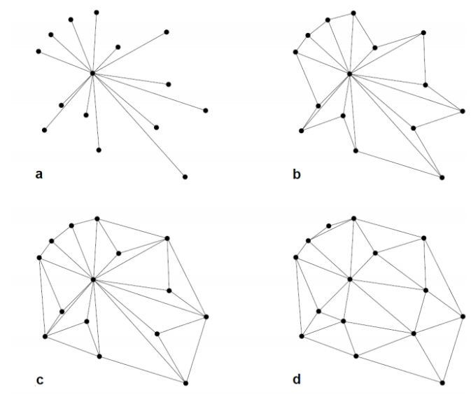

2. Rekursiv splitt-algoritme (eng. recursive split algorithm)

   

3. Del-og-hersk algoritme (eng. divide-and-conquer algorithm)

   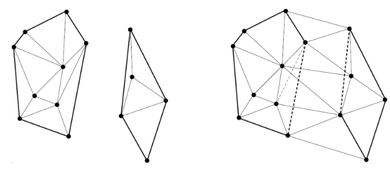

4. Trinn-for-trinn algoritme (eng. step-by-step algortihm)

   (Se under)

5. Modifisert hierarkisk algoritme (eng. modified hierarchical algorithm)

   

**Dynamiske:**  Dynamisk triangulering tar en rekursiv oppdeling av planet i trekanter. Den starter med noen store trekanter som dekker hele området. Disse deles så opp i mindre trekanter etter litt ulike prinsipper.

Alltid gyldig TIN, kan sette ut og ta inn punkt. 

1. Inkrementell algoritme (eng. incremental algorithm)
2. Inkrementell slett-og-bygg algortime (eng. incremental delete-and-build
algorithm)

#### 14.06 Kjenne spesielt til “Step-by-step” og “Inkrementell” algoritme

**Step-by-step**: 

1. velg et vilkårlig punkt $A$ og finn punktet $B$ som ligger nærmest $A$, linjen fra $A$ til $B$ blir basislinjen
2. Finn ett tredje punkt som sammen med basislinjen danner et triangel slik at betingelsene i krav 1 til 3 er oppfylt. 
   - Krav 1: Ikke-overlappende
   - Krav 2: Så lite rektangel som mulig
   - Krav 3: Får ikke lov til å krysse spesifiserte linjer (aka knekkpunkt eller lignende)
3. Dersom trekant er funnet etableres det tilhørende triangelet, sidene legges i en kø.
4. Hent en triangelside fra køen, benytt denne som basislinje og gjenta steg 2, 3 og 4 til køen er tom. 

Man velger triangel utifra pilhøyden til basislinjen og sirkelbuen som formes av de aktuelle punktene. 

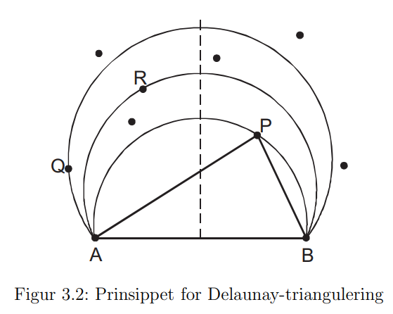

**Inkrementell**: 

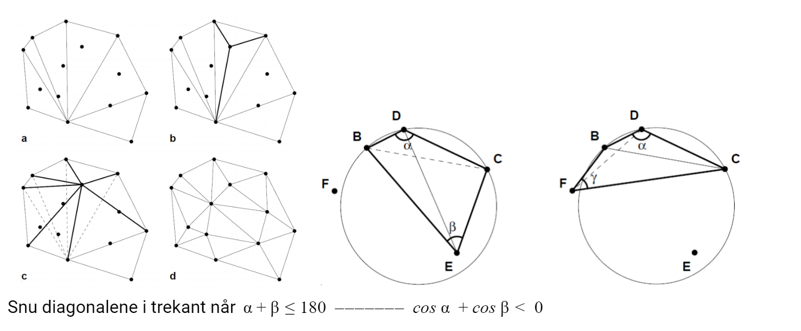

1. C og T mengder av trekanter, C = 0, T= alle initielle trekanter, L_i= datapunkter i t_i (trekanter)
2. Velg et tilfeldig punkt k fra L, del dens trekant i tre oppdater sånn at du får to nye t_i.

#### 14.07 Kjenne til hvordan nye kanter er implementert i datastruktur

**Innsetting**: Har ikke så mye å si for formen på et unikt delaunay-nettverk, men kan ha noe med kjøretiden å gjøre. Større påvirkning på kjøretid eller selektivt nettverk.

Må sjekke i E-tabellen:

1. Alle punkter får initielt verdien 'Ikke benyttet'
2. Dersom det 3. punktet i en trekant er 'Ikke benyttet' vet man at man kan legge inn de to nye kantene. 
3. Hvis ikke må man sjekke hele E-tabellen.  

#### 14.08 Vite hvordan punkt som havner på en linje er håndtert i inkrementell algoritme

#### 14.09 Kjenne til hvordan sortering av punkter foregår under trianguleringen (til inkrementell?)

Når en ny diagonal settes inn sorteres punktene til de tilhørende nye trekantene. Hjelper med å finne kandidater til noe. 

#### 14.10 Vite hva man mener med bruddlinjer i terrenget/terrengmodellen

**Hva bruddlinjer er:** Bratte områder, stor endring i høyde. Viktig at trianguleringen går langs med, og ikke krysser bruddlinjen, fordi det er langs det er viktig informasjon

1. Utfør vanlig triangulering med punktmengden D0 uten hensyn til knekklinjene.

2. Søk etter skjæringspunkt mellom knekklinjer og triangelsidene. Dersom dette finnes:

3. Opprette nye noder i krysningspunkt S

4. Trianguler på nytt med punktmengden D1 = D0 union S

   (statisk triangulering når man må starte hele prosessen på nytt. Ved dynamisk Delauney triangulering gjør man bare en lokal retriangulering med skjæringspunktene!)

#### 14.11 Kjenne til prinsipp for dynamisk fjerning av punkt frå et trekantnettverk, og vite hvorfor en O(n2) algoritme kan være raskere enn en O(nlogn) algoritme

**Dynamisk fjerning:**

1. Det omskrivende polygonet til det punktet som skal slettes, blir oppsøkt
2. Legg omskrivne sirkler gjennom de tre endepunktene til de to påfølgende sidene i polygonet.
3. Trekant med minst omskrivne sirkel velges
4. Fortsett til hele området innenfor polygonet er triangulert.

**hvorfor en O(n2) algoritme kan være raskere enn en O(nlogn) algoritme**: Asymptotisk notasjon gir bare hvordan en algoritme oppfører seg gitt en stor nok n, konstantledd ignoreres. Derfor er det mulig for små nok n at en O(nlgn)-algoritme er treigere, hvis foreksempel konstantleddene er høye. 

#### 14.12 Kjenne til enkle rutiner for å finne om et punkt ligger innenfor en trekant

**Alternativ 1**: Innenfor polygonet-algoritme (kan utnytte at en trekant alltid er konveks)

**Alternativ 2**: Utnytte det forholdet at punktet P sammen med det aktuelle triangelets tre hjørner ABC definerer tre nye triangler og analyserer arealet til trianglene.

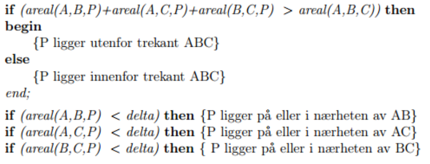

#### 14.13 Kjenne til hvordan man kan søke i et TIN

Når man står i en node ser man på vinklene til nabonodene. Utifra det vet vi om punkt er nærmere det man leter etter eller ikke.

#### 14.14 Kjenne til prinsippene for kvalifisert valg av punkt som skal inkluderes i et TIN

**Kvalifisert innsetting av punkt** Feks: Avstanden mellom punktet og terrengplanet til den trekanten punktet skal inkluderes i. Skrankeverdien kan være en funksjon av feks terrenghøyden eller avstanden til et evt projeksjonssenter.

#### 14.15 Kjenne til metoder for oppdeling av TIN i blokker og hvordan disse kan sys sammen

- Delete and build

  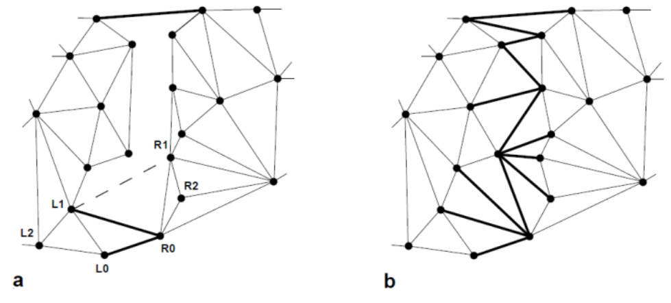

- Build and swap

  

- Merge and swap

  

#### 14.16 Vite hva man mener med 3D Delaunay nettverk, og hva som er geometriske vilkår for disse

**3D-delauney-nettverk**: Et Delauney-nettverk i 3D er satt sammen av ikke-overlappende tetraeder, slik at ingen nodepunkt i nettverket er omsluttet av noen av de omskrivne kulene til tetraedrene i nettverket. (Kulevilkåret)

#### 14.17 Kunne forklare hvordan et hexaeder kan deles i tetraeder

#### 14.18 Kjenne til en datastruktur for 3D TIN

**Datastruktur:** Ved utvidelse til 3D må man også ta høyde for et fjerde nivå, tetraeder. 

**3D-variant av twin-edge:** 

- Enten bytte ut tvilling-kant-strukturen til en tvilling-plan-struktur
- Beholde sidekantene som basiselement, men utvides med enda en tvillingpeker, dette er da en dobbel tvilling-kant-struktur. 

#### 14.19 Kjenne til prinsippene for inkrementell danning av TIN i 3D

1. konstruer et omskrivende tetraeder for punktsettet
2. Sett inn et punkt ved å 
   - Dele punktet sitt omskrivende tetraeder inn i fire nye tetraeder
   - Omorganiser nettverket rundt det insatte punktet til alle tetraedene oppfyller kuleprinsippet
3. Etter omorganisering, gjenta punkt 2. 

#### 14.20 Kjenne til kvalifisert valg av punkt i 3D

**Prinsipp**: Splitte tetraedet i punktet som gir størst bidrag til modellen. 

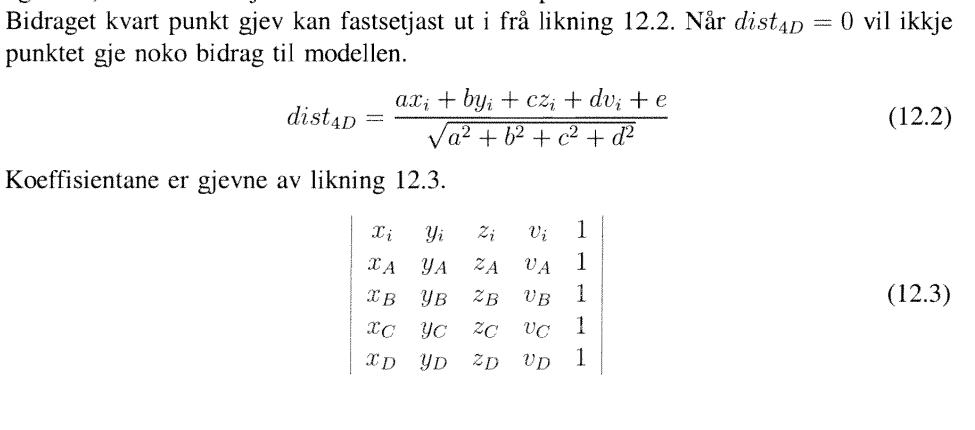

## 15 Informasjonsteori

#### 15.01 Kjenne til ulike modeller for kartografisk kommunikasjon

**Shannon og Weaver**: Baserer seg på sendersystem, mottakersystem og støysystem. Handler om å forme det man vil formidle til et signal, som på veien blir påvirket av et støysystem før det mottas. 

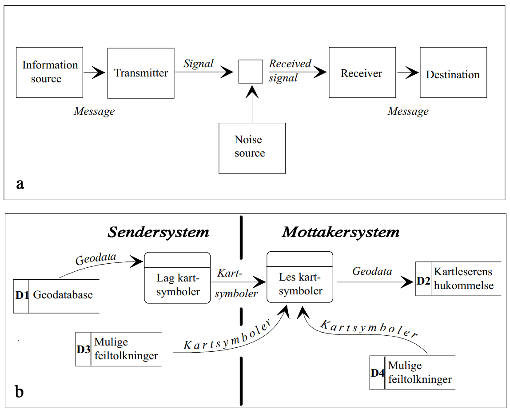

**Kol´a˘cnys diagram**: Ligner på Shannon og Weaver, med det unntak av at det ikke er modellert at kartleseren kan feiltolke deler av kartinnholdet. Den beskriver på den andre siden kartleseren og kartografens kunnskap om virkeligheten, og et viktig poeng er at man må se på helheten for å lage gode kart. 

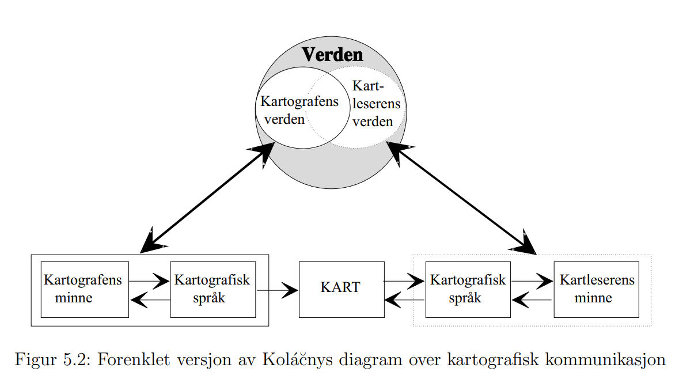

**Robinson og Petcheniks modell**: Bruker venndiagram for å beskrive kognitive komponenter i kartografisk kommunikasjon. 

$S_k$ og $S_f$: Henholdsvis mengdene for korrekt og feilaktig kunnskap om objekter i det geografiske rom. 

$A$ og $B$: Den kunnskap (både korrekt og feilaktig) som henholdsvis kartograf og kartleser har til felles. 

$M_1, M_2, M_3, U$: Rektangelet som angir mengden uttrykt via et gitt kart.

$M_1$: Det kartleseren visste fra før av

$M_2$: Representerer mengden kunnskap kartleseren ikke visste fra før av, men nå observerer

$M_3$: Representerer kunnskapen kartleseren ikke oppfatter

$U$: Representerer indirekte økning i kartografisk kunnskap, siden kartografen ved hjelp av induksjon kan hente ut ny kunnskap basert på sitt eget kart. 

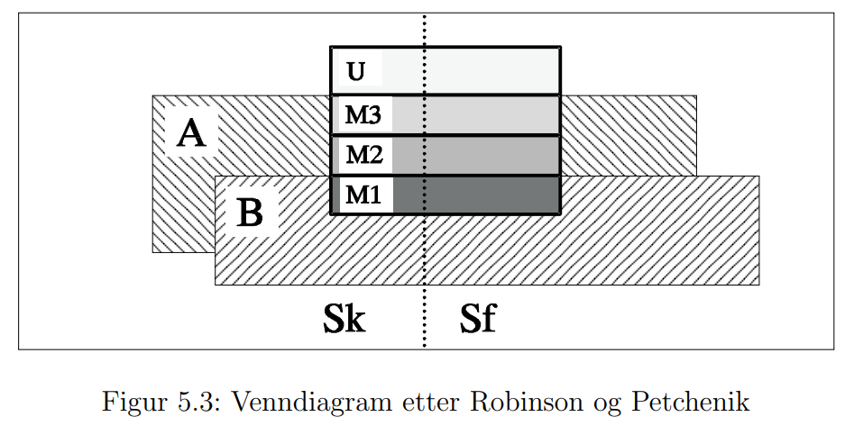

**Morrisons modell**: 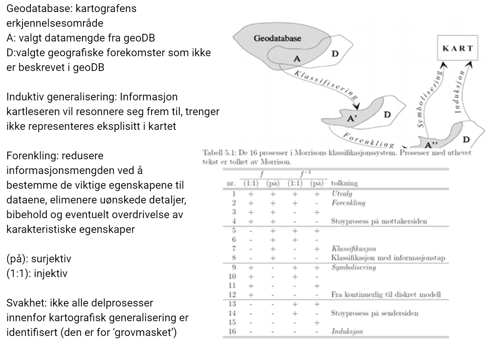

**Bjørkes modell**: Baserer seg på morrisons modell, men tar også høyde for automatiserte prosesser. Stiplede linjer viser grensen mellom automatiserte og ikke-automatiserte prosesser. 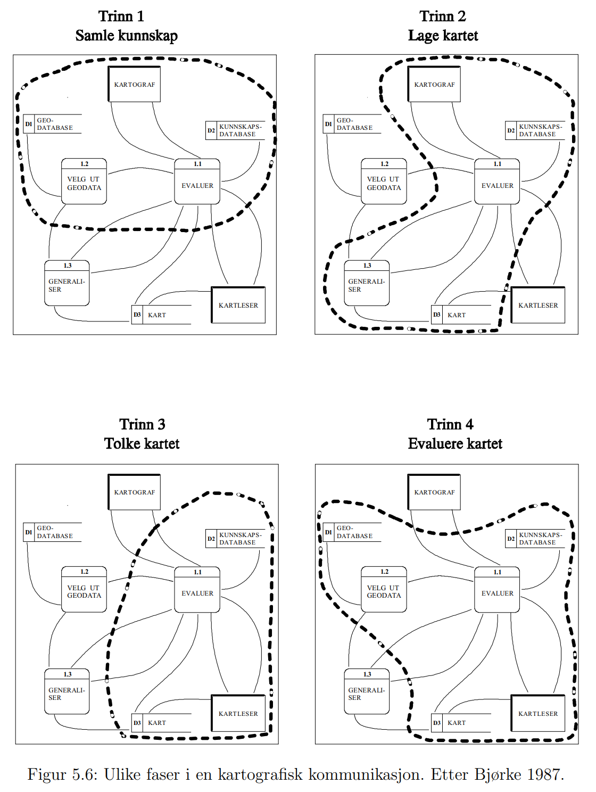

#### 15.02 Kjenne til 3 nivå for kommunikasjon

**Syntaktisk nivå**: Hvor nøyaktig symboler lar seg overføre

**Semantisk nivå**: Hvor presist er symbolene istand til å overføre meningsinnholdet

**Pragmatisk nivå**: Hvor effektivt lar den mottate mening seg utnytte til å gjøre beslutninger på foreliggende problemer. 

#### 15.03 Vite hva man mener med begrepet entropi

**Entropi**: Grad av uorden, en enhet uten dimensjon, som kan brukes til å gjøre forholdsmessige sammenligninger. 
$$
H(x)=\sum_{x\in X}p(x)\log_2(\frac{1}{p(x)}=-\sum_{x\in X}p(x)\log_2(p(x)
$$

#### 15.04 Kunne utføre enkle entropiberegninger

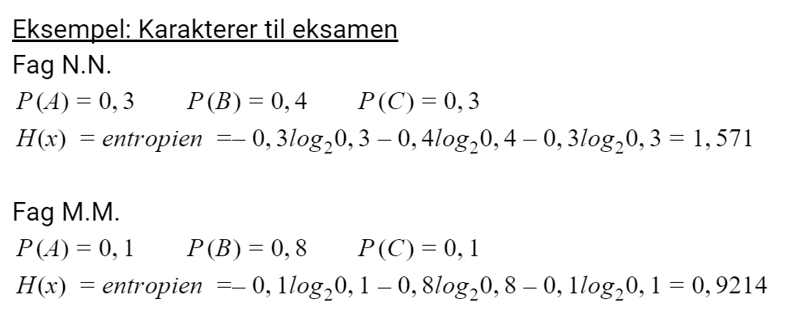

#### 15.05 Kunne utføre entropiberegninger med flere informasjonsvariable, både når variablene er statistisk uavhengige og statistisk avhengige

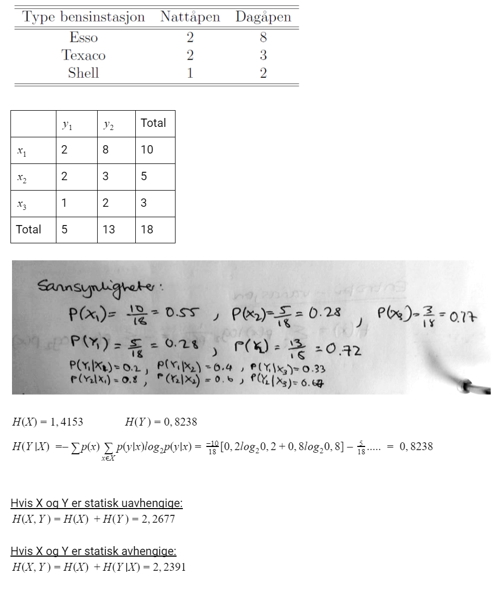

#### 15.06 Vite hvordan man kan gjøre entropiberegninger på romlige figurer

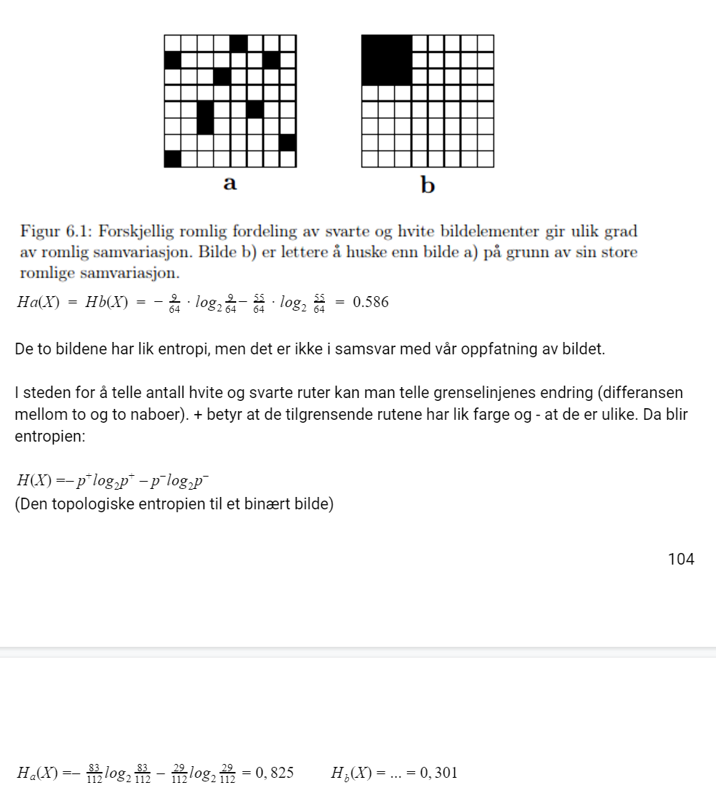

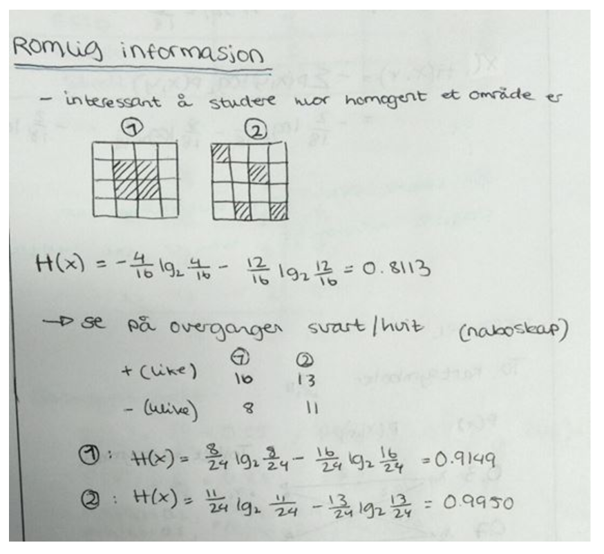

#### 15.07 Vite hva man mener med begrepet equivocation

**Equivocation**: Er et annet ord for informasjonstap. 
Informasjonstap $H(X|Y)$ er uttrykt som betinget entropi. 

$X$ er kartsymboler og $Y$ er tolkningen av kartsymbolene. 

#### 15.08 Kunne regne ut informasjonstap og nyttig informasjon i enkle modeller

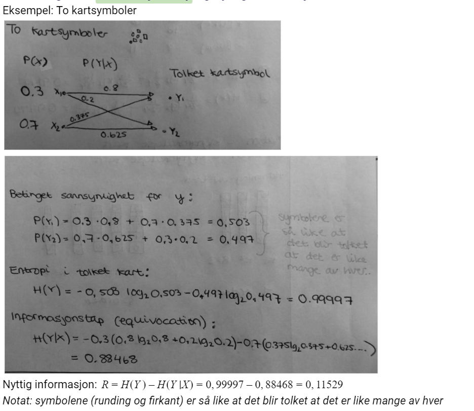

#### 15.09 Kjenne til prinsippet for strukturering av informasjon ved hjelp av “Seriation”

**Seriation**: Man presenterer datagrunnlaget i en toveis tabell og at denne tabellen reorganiseres ved å bytte om på rader og kolloner til den når en maksimal ordning. 
Hvis man ser på tabellen som et binært bilde der hvert felt i tabellen enten er True eller False, handler det om å reorganisere tabellen (uten å endre meningsinnholdet) så man får et så ordnet(samlet bilde som mulig)

#### 15.10 Vite hva en Hammingavstand av 1-orden og k-orden er

**Hammingavstand**: Et mål på hvor mange ruter som grenser til naboruter av ulik farge. 

**1-orden**: ser på direkte naboer

**k-orden**: Ser på mer perifere naboer for å se globale trender. Velges utifra: w(k) = 0 dersom k > n/4 ellers k = 1. Dette er grunnen til valget av P R36 i tabell
6.3.

#### 15.11 Kjenne til det grunnleggende i algoritmene for Kvikk-ordner og Gruppeordner

**Kvikk-ordner**: Kvikk-ordner tester kun på 1. ordens naboskap, så bildet kan få en syklisk tendens. Har derfor en antisykel-konstant $\alpha$

1. Flytt den mest vite raden til toppen av bildet og den mest hvite kolonnen til venstre i bildet. Ved likt trekkes det automatisk
2. De resterende $(n-1)$ radene og $(m-1)$ kolonnene reorganiseres i henhold til en lokal evaluering som baseres på henholdsvis $R_1$ og $C_1$. 
   Regn hammingavstand for rad 1 mot de ndre readene, flytt den raden med minst Hamming-avstand opp til neste rad. Benytt tilsvarende prosedyre for kolonnene. 

**Gruppeordner**: 

1. Operatør skal peke på rader som synes å tilhøre en homogen gruppe av rader. 
2. Basert på gruppedefinisjonene beregnes en gjennomsnittsvektor for hver av radene. Deretter flyttes rader til den gruppen de har størst tilhørighet til. Hvis det ikke finnes en bra match flyttes vektoren til en støygruppe. 
3. Gruppene blir organisert basert på gjennomsnittsvektoren, nok en gang basert på prossedyre fra Kvikk-ordner. 

## 16 Informasjonsvisualisering

#### 16.01 Skal ha en oversikt over klassiske samt moderne metoder for informasjonsvisualisering

- Tidsserier
  - Index (prosent/endringsrate)
  - Sparklines(overordnede trender)
  - Stacked Graph(aggregerer data)
  - Small multiples(se overordnede trender, alle visualiseringer kan brukes)
- Statistiske visualiseringer
  - Box (Kvartiler, outliers og fordeling)
  - Violin (box + distribusjon)
  - Scatter (Sammenligne mellom dimensjoner, kan se sammenhenger (brushing/linking))
  - Parallel coordinates (Sammenligne mellom flere dimensjoner)
  - Radar (sammenligne flere dimensjoner)
- Hierarkier
  - Kant-node diagrammer og dendogrammer (clustervisualisering og zoom-nivåer i rutentt)
  - Sunburst: Mange dimensjoner og tidsdimensjon
  - Treemaps: Deler rektangler relativt til hierarkiet Høyere foreldrenoder er ikke fremtredende Veldig effektiv plassutnyttelse
  - Packed circles: Ligner på treemaps, bruker sirkler og sløser med plass
- Grafer
  - Force directed layout, noder frastøter hverandre, kanter tiltrekker, vekt på kant definerer hvor mye man trekker
  - Arc diagrams: En-dimensjonal representasjon av graf, klikker og broer lette å se, ellers er annen struktur vaskelig å se
  - Matriser: Correlation/confusion matrix, kan fargelegges, som oftest diagonal
- Kart
  - Flow maps: Rik på informasjon, viser både tid og mengde
  - Dot Maps: Enkelt og effektivt, best med overlappende data for trender
  - Heat maps: Cluster-visning, nytteverdi er mye omdisktuert
  - Choroplet map: Må normalisere verdier til landområde, kan bruke andre visuelle variable enn farge
  - Skalerte sirkler/symboler: Bør være psykologisk skalert
  - Kartogram: Geografisk form er byttet ut med symbol, størrelse representerer data, plassering er relativt likt som geografisk
  - Innendørskart: 
  - 3D tematiske kart: Visuelt attraktivt, begrensninger på objektiv resentasjon

#### 16.02 Skal kjenne igjen bruksområder for ulike visualiseringsmetoder

[Se punkt 1]

#### 16.03 Skal ha kjennskap til hvilke visualiseringsmetoder som egner seg spesielt godt til visualisering av geografisk informasjon

[Se punkt 1]

#### 16.04 Skal ha en oversikt over moderne verktøy for informasjonsvisualisering

#### 16.05 Skal ha en oversikt over moderne programmeringsverktøy for informasjonsvisualisering

## 17 Satellittdata

#### 17.01 Ha oversikt over ulike tidsaktuelle EO – earth observation teknologier

Landsat8

Sentinel2

Galileo

Droner og fly

Planet og Maxar ($$$)

#### 17.02 Ha grunnleggende forståelse for public cloud og endringer dette skaper

- Enorm datatilgang, enkelt
- Utviklervenlig
- Google cloud, AWS, Azure
- analyser i real-time

#### 17.03 Ha oversikt over måter å distribuere og utnytte svært store, oppdaterte datasett gjennom public cloud

- Open data cube
- Python (ML/AI biblioteker)

#### 17.04 Ha en innsikt i konkrete problemstillinger maskinlæring og AI kan løse

- FKB
- Tanzania

[I got his]

#### 17.05 Ha innsikt inn i flere konkrete eksempler på anvendelser av EO-data i AWS

- OpenStreetMap
- CentinelHub

## Eksamener knyttet opp mot læringsmål

### 2013

**Oppgave 1**

Læringsmål: 01.03 Vite hva som kjennetegner konveks, stjerneformet og monotont polygon
Læringsmål: 01.04 Kjenne til ulike typer transformasjoner i det Euklidiske plan

**Oppgave 2**

Læringsmål: 10.04 Kjenne til datastrukturen dobbel-linket kantliste (DCEL)

Læringsmål: Fri fantasi

**Oppgave 3**

Læringsmål: fri fantasi, foreksempel lenkede lister
Læringsmål: 09.09 Vite hva et PR-kvadtre er og hvordan sette inn eller slette et punkt
**Oppgave 4**
Læringsmål: 09.20 Kjenne til prinsippet for Excell, og kunne bruke hashfunksjonen for denne
Læringsmål: 09.21 Kjenne prinsippet for Gridfile, og kunne bruke hashfunksjonen for denne

**Oppgave 5**

Læringsmål: 04.01 Vite hva vi mener med flytende mengder og komme med ulike eksempler
Læringsmål: 10.12 KJenne til en algoritme for å finne om et punkt er innenfor et polygon

### 2014

**Oppgave 1**
Læringsmål: 15.04 Kunne utføre enkle entropiberegninger
Læringsmål: 15.08 Kunne regne ut informasjonstap og nyttig informasjon i enkle modellar

**Oppgave 2**
Læringsmål: 01.02 Kjenne til definisjoner og grunnleggende egenskaper til punktobjekt, linjeobjekt og polygonobjekt
Læringsmål: 10.08 Kjenne til algoritme for avstand punkt - linje

**Oppgave 3**
[Vet ikke enda]

**Oppgave 4**
Læringsmål: 05.09 Vite hva vi mener med 9-snittsmodellen
Læringsmål: 05.07 Kjenne til definisjonen på romlige regioner

**Oppgave 5**
Læringsmål: 09.08 Kunne lage en algoritme for å finne naboer til et kvadtre
Læringsmål: 09.23 Kjenne til prinsippet for R-tre og hvordan denne er bygd opp
Læringsmål: 09.23 Vite forskjellen mellom R-tre og R+-tre

### 2015

**Oppgave 1**

### 2017

### 2018

